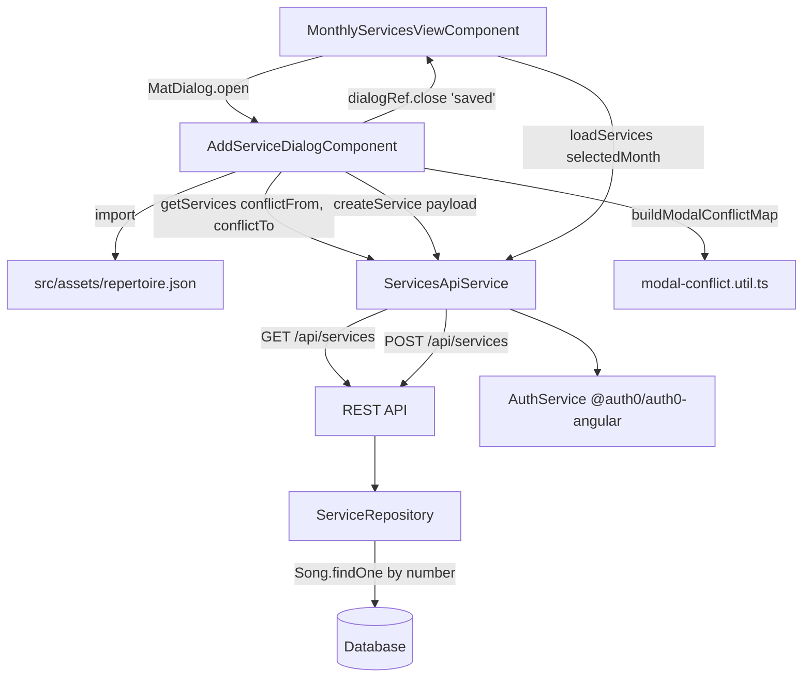

# Design Document: Add Service Hymns Modal

## Overview

The Add Service Hymns Modal is a new Angular Material dialog (`MatDialog`) opened from the Monthly Services View toolbar. It allows a music planner to create a new worship service and assign song numbers to all 14 of its slots in a single interaction. The dialog provides:

- A service date picker (any date, not restricted to the viewed month)
- A free-text service type field
- 14 song-slot inputs grouped by category (orchestra × 5, choir × 4, congregation × 5)
- Autocomplete backed by the bundled `repertoire.json`
- Per-slot conflict badges that update in real time as numbers are typed
- A Save button that calls `POST /api/services` and reloads the monthly view on success

All API calls reuse the existing `ServicesApiService` (Auth0 token attachment included). Conflict detection uses a new pure helper function, `buildModalConflictMap`, that mirrors the existing `ConflictDetectionService.buildConflictMap` logic but operates on a mix of fetched window services and a synthetic draft service built from the form state.

---

## Architecture



### New files

```
src/app/monthly-services-view/
  components/
    add-service-dialog/
      add-service-dialog.component.ts      # Standalone MatDialog content component
      add-service-dialog.component.html
      add-service-dialog.component.css
  models/
    repertoire.model.ts                    # RepertoireEntry interface
  services/
    modal-conflict.util.ts                 # Pure buildModalConflictMap helper
```

### Modified files

```
src/app/monthly-services-view/
  monthly-services-view.component.ts       # Add "Add Service" button + dialog trigger
  monthly-services-view.component.html     # Render the new button
  services/services-api.service.ts        # Add createService() method
  models/service.model.ts                  # Add CreateServicePayload, CreateServiceSlotInput

music-planner-api/src/
  repositories/ServiceRepository.ts        # Accept songNumber in SlotInput; resolve to songId
```

---

## Components and Interfaces

### MonthlyServicesViewComponent (changes only)

Two additions:

1. Inject `MatDialog` and add an `openAddServiceDialog()` method:

```typescript
openAddServiceDialog(): void {
  const dialogRef = this.dialog.open(AddServiceDialogComponent, {
    width: '800px',
    disableClose: true
  });
  dialogRef.afterClosed().subscribe(result => {
    if (result === 'saved') {
      this.loadServices(this.selectedMonth);
    }
  });
}
```

2. The template gains an "Add Service" `mat-raised-button` in the toolbar row, always visible.

---

### AddServiceDialogComponent

**Standalone component** opened via `MatDialog`. Owns the entire form lifecycle.

**Material imports required:**
`MatDialogModule`, `MatFormFieldModule`, `MatInputModule`, `MatButtonModule`, `MatDatepickerModule`, `MatMomentDateModule`, `MatAutocompleteModule`, `MatProgressSpinnerModule`, `MatTooltipModule`, `MatSnackBarModule`, `FormsModule`, `ReactiveFormsModule` (only for the custom validator), `CommonModule`

**Lifecycle:**

| Phase | Action |
|---|---|
| `ngOnInit` | Build `repertoireMap` (`Map<string, RepertoireEntry>`) and `repertoireSet` (`Set<string>`) from the JSON import. Initialise 14 `slotStates`. If `serviceDate` is already set, fetch the conflict window. |
| Date change | Call `fetchConflictWindow(date)` → updates `windowServices` → triggers `rebuildConflictMap()` |
| Any slot number change | Call `rebuildConflictMap()` |
| Save | Validate → call `servicesApiService.createService(payload)` → close with `'saved'` on 201 |
| Cancel / Escape | `dialogRef.close()` with no result |

**Internal state:**

```typescript
interface SlotState {
  slotKey: string;
  category: 'orchestra' | 'choir' | 'congregation';
  displayOrder: number;
  songNumber: string;                     // bound via ngModel
  filteredOptions: RepertoireEntry[];     // current autocomplete options
  conflictStatus: SlotConflictStatus | null;
}
```

**Slot template constant** (hardcoded, never fetched):

```typescript
export const SLOT_TEMPLATES: SlotState[] = [
  { slotKey: 'orchestra1',       category: 'orchestra',     displayOrder: 1,  songNumber: '', filteredOptions: [], conflictStatus: null },
  { slotKey: 'orchestra2',       category: 'orchestra',     displayOrder: 2,  songNumber: '', filteredOptions: [], conflictStatus: null },
  { slotKey: 'orchestra3',       category: 'orchestra',     displayOrder: 3,  songNumber: '', filteredOptions: [], conflictStatus: null },
  { slotKey: 'orchestra4',       category: 'orchestra',     displayOrder: 4,  songNumber: '', filteredOptions: [], conflictStatus: null },
  { slotKey: 'orchestra5',       category: 'orchestra',     displayOrder: 5,  songNumber: '', filteredOptions: [], conflictStatus: null },
  { slotKey: 'choir1',           category: 'choir',         displayOrder: 6,  songNumber: '', filteredOptions: [], conflictStatus: null },
  { slotKey: 'choir2',           category: 'choir',         displayOrder: 7,  songNumber: '', filteredOptions: [], conflictStatus: null },
  { slotKey: 'choir3',           category: 'choir',         displayOrder: 8,  songNumber: '', filteredOptions: [], conflictStatus: null },
  { slotKey: 'choir4',           category: 'choir',         displayOrder: 9,  songNumber: '', filteredOptions: [], conflictStatus: null },
  { slotKey: 'congregationBS',   category: 'congregation',  displayOrder: 10, songNumber: '', filteredOptions: [], conflictStatus: null },
  { slotKey: 'congregationOH',   category: 'congregation',  displayOrder: 11, songNumber: '', filteredOptions: [], conflictStatus: null },
  { slotKey: 'congregationRP',   category: 'congregation',  displayOrder: 12, songNumber: '', filteredOptions: [], conflictStatus: null },
  { slotKey: 'congregationCM1',  category: 'congregation',  displayOrder: 13, songNumber: '', filteredOptions: [], conflictStatus: null },
  { slotKey: 'congregationCM2',  category: 'congregation',  displayOrder: 14, songNumber: '', filteredOptions: [], conflictStatus: null },
];
```

**Grouping for template rendering:**

```typescript
get slotGroups(): { category: string; slots: SlotState[] }[] {
  return [
    { category: 'orchestra',    slots: this.slotStates.filter(s => s.category === 'orchestra') },
    { category: 'choir',        slots: this.slotStates.filter(s => s.category === 'choir') },
    { category: 'congregation', slots: this.slotStates.filter(s => s.category === 'congregation') },
  ];
}
```

**Autocomplete filtering** (called on each keyup for a slot's input):

```typescript
filterOptions(slot: SlotState): void {
  const prefix = (slot.songNumber ?? '').toLowerCase();
  slot.filteredOptions = prefix.length === 0
    ? []
    : this.repertoire.filter(e => e.number.toLowerCase().startsWith(prefix));
}
```

Display format for each autocomplete option: `number (→ translation)` when `translation` is non-empty, else just `number`.

**Custom validator** (for each slot's `NgModel`):

```typescript
function repertoireValidator(repertoireSet: Set<string>): ValidatorFn {
  return (control: AbstractControl): ValidationErrors | null => {
    const val: string = control.value ?? '';
    if (val === '') return null;               // empty is allowed
    return repertoireSet.has(val) ? null : { unknownSong: true };
  };
}
```

**Submit flow:**

```typescript
onSave(): void {
  if (this.form.invalid) return;
  this.saving = true;

  const payload: CreateServicePayload = {
    serviceDate: moment(this.serviceDate).format('YYYY-MM-DD'),
    serviceType: this.serviceType,
    slots: this.slotStates.map(s => ({
      slotKey: s.slotKey,
      songNumber: s.songNumber.trim() || null
    }))
  };

  this.servicesApiService.createService(payload).subscribe({
    next: () => this.dialogRef.close('saved'),
    error: (err: HttpErrorResponse) => {
      this.saving = false;
      this.submitError = err.status === 409
        ? 'A service with this date and type already exists.'
        : `Failed to save service (${err.status}).`;
    }
  });
}
```

---

### ServicesApiService (addition)

```typescript
createService(payload: CreateServicePayload): Observable<Service> {
  return this.withToken(token =>
    this.http.post<Service>('/api/services', payload, {
      headers: { Authorization: `Bearer ${token}` }
    })
  );
}
```

---

## Data Models

### Frontend additions (`service.model.ts`)

```typescript
export interface CreateServiceSlotInput {
  slotKey: string;
  songNumber: string | null;   // null for empty slots
}

export interface CreateServicePayload {
  serviceDate: string;          // YYYY-MM-DD
  serviceType: string;
  slots: CreateServiceSlotInput[];
}
```

### Frontend new file (`repertoire.model.ts`)

```typescript
export interface RepertoireEntry {
  number: string;
  translation: string;          // empty string when no translation exists
}
```

The asset `repertoire.json` is structured as `{ "songs": RepertoireEntry[] }` (plus additional fields `signature`, `tempo`, `familiarity` that the modal ignores). Only `number` and `translation` are used.

### Backend update (`ServiceRepository.ts`)

```typescript
// Updated interface — backward-compatible
export interface SlotInput {
  slotKey: string;
  songId?: string | null;       // pre-resolved UUID (used by existing PUT path)
  songNumber?: string | null;   // song number string (used by new POST path)
}
```

Resolution logic in `ServiceRepository.create`:

```typescript
// Per slot resolution:
let resolvedSongId: string | null = null;
if (entry.songId !== undefined && entry.songId !== null) {
  resolvedSongId = entry.songId;
} else if (entry.songNumber) {
  const song = await Song.findOne({ where: { number: entry.songNumber } });
  resolvedSongId = song?.id ?? null;
}
// Use resolvedSongId when creating ServiceSlot
```

---

## Modal Conflict Detection

### Why a separate helper is needed

`ConflictDetectionService.buildConflictMap` expects a `Service[]` where each slot has a populated `song` object with a UUID-based `songId` and an optional `translationOf.number`. The form's draft state has only raw song number strings — no UUIDs, no `Song` objects. Rather than shoehorning the draft state into the existing service's interface, a dedicated pure helper handles the mixed input.

### `buildModalConflictMap` — signature and algorithm

**File:** `src/app/monthly-services-view/services/modal-conflict.util.ts`

```typescript
export interface DraftSlot {
  slotKey: string;
  songNumber: string;  // non-empty, already validated as present in repertoire
}

export type ModalConflictMap = Record<string, SlotConflictStatus>;

export function buildModalConflictMap(
  windowServices: Service[],
  draftSlots: DraftSlot[],
  serviceDate: string,             // YYYY-MM-DD — date of the draft service
  repertoireMap: Map<string, RepertoireEntry>
): ModalConflictMap
```

**Algorithm:**

```
1. Build occurrences from window services (same as ConflictDetectionService):
   windowOccurrences = windowServices.flatMap(svc =>
     svc.serviceSlots
       .filter(slot => slot.song !== null)
       .map(slot => ({
         slotId:          slot.id,
         serviceId:       svc.id,
         serviceDate:     svc.serviceDate,
         serviceType:     svc.serviceType,
         canonicalNumber: slot.song.translationOf?.number ?? slot.song.number
       }))
   )

2. Build occurrences from draft slots:
   draftOccurrences = draftSlots
     .filter(slot => slot.songNumber.trim() !== '')
     .map(slot => {
       const entry = repertoireMap.get(slot.songNumber);
       const canonicalNumber = (entry?.translation && entry.translation !== '')
         ? entry.translation
         : slot.songNumber;
       return {
         slotId:          slot.slotKey,   // synthetic ID = slotKey
         serviceId:       'draft',
         serviceDate:     serviceDate,
         serviceType:     'draft',
         canonicalNumber
       };
     })

3. allOccurrences = [...windowOccurrences, ...draftOccurrences]

4. conflictMap: ModalConflictMap = {}

5. For each draftOccurrence D in draftOccurrences:
   worstSeverity = null
   conflictingDates = []

   For each other O in allOccurrences:
     if O.serviceId === 'draft' && O.slotId === D.slotId: skip (same draft slot)
     if O.canonicalNumber !== D.canonicalNumber: skip

     diffDays = |moment(D.serviceDate).diff(moment(O.serviceDate), 'days')|
     severity:
       diffDays <= 56  → 'red'
       57–90           → 'yellow'
       91–365          → 'green'
       > 365           → null

     if severity !== null:
       conflictingDates.push({ date: O.serviceDate, serviceType: O.serviceType })
       update worstSeverity (red > yellow > green)

   conflictMap[D.slotId] = { severity: worstSeverity, conflictingDates }

6. Return conflictMap
```

The result is keyed by `slotKey` (since draft slots have no real slot IDs). The dialog component maps this directly to its `SlotState` array using `slotKey`.

### When `rebuildConflictMap()` is called in the dialog

- On every keyup/change in any song number input (after autocomplete selection or manual entry)
- Whenever `serviceDate` changes (after new window services are fetched)
- Only slots with non-empty, valid song numbers are included in `draftSlots`

---

## Conflict Window Date Range

For any selected service date D:

```
conflictFrom = moment(D).subtract(365, 'days').format('YYYY-MM-DD')
conflictTo   = moment(D).add(365, 'days').format('YYYY-MM-DD')
```

This is a ±365-day window (as opposed to the monthly view's ±12-month window). The fetch is triggered once when the modal opens with a pre-set date, and again whenever the date picker value changes.

---

## Correctness Properties

*A property is a characteristic or behavior that should hold true across all valid executions of a system — essentially, a formal statement about what the system should do. Properties serve as the bridge between human-readable specifications and machine-verifiable correctness guarantees.*

### Property 1: Autocomplete filters by prefix

*For any* repertoire R and any typed prefix P, the autocomplete suggestions returned SHALL contain exactly the entries in R whose `number` starts with P (case-insensitive), and no other entries.

**Validates: Requirements 4.8**

---

### Property 2: Repertoire validator rejects unknown numbers and accepts known ones

*For any* song number S not present in the repertoire Set, the slot validator SHALL return a non-null validation error object. *For any* song number S that is present in the repertoire Set, the slot validator SHALL return null (valid).

**Validates: Requirements 4.9**

---

### Property 3: Canonical number resolution uses translation when non-empty

*For any* entered song number S where the repertoire contains an entry with `number === S` and a non-empty `translation` T, the canonical number used in conflict detection SHALL be T. *For any* S where `translation` is empty or absent, the canonical number SHALL be S itself.

**Validates: Requirements 4.10, 5.8**

---

### Property 4: Conflict window date range is exactly ±365 days

*For any* selected service date D, the `from` parameter passed to `ServicesApiService.getServices` SHALL equal `moment(D).subtract(365, 'days').format('YYYY-MM-DD')` and the `to` parameter SHALL equal `moment(D).add(365, 'days').format('YYYY-MM-DD')`.

**Validates: Requirements 5.1, 2.5, 5.9**

---

### Property 5: POST payload contains exactly 14 slot entries

*For any* combination of filled and empty slot form states, the `slots` array in the POST body submitted to `POST /api/services` SHALL contain exactly 14 entries — one per slot key — with `songNumber` set to `null` for any slot whose input is empty.

**Validates: Requirements 6.2, 6.3**

---

### Property 6: Service type field accepts any non-empty string

*For any* non-empty string S, the `serviceType` form field SHALL produce no validation error when S is its value.

**Validates: Requirements 3.3**

---

## Error Handling

| Scenario | Behaviour |
|---|---|
| Auth0 token fetch fails | Display authentication error; do not call API |
| `GET /api/services` (conflict window) fails | Conflict badges are suppressed; form remains usable; show non-blocking warning |
| `POST /api/services` returns 201 | Close dialog with `'saved'`; monthly view reloads |
| `POST /api/services` returns 409 | Keep dialog open; show inline error "A service with this date and type already exists." |
| `POST /api/services` returns other 4xx/5xx | Keep dialog open; show inline error with status code |
| POST is in flight | Disable "Save" button and all form fields; show spinner in the Save button |
| Cancel / Escape | Close dialog without any API call; no state change in monthly view |
| Song number typed but not in repertoire | Show `mat-error` on that slot; slot is excluded from conflict detection; POST is blocked |
| serviceDate empty on submit | Show `mat-error` on date field; POST is blocked |
| serviceType empty on submit | Show `mat-error` on type field; POST is blocked |

---

## Testing Strategy

### Dual Testing Approach

- **Unit tests** (Karma + Jasmine): specific examples, edge cases, error conditions, component wiring
- **Property-based tests** (fast-check): universal properties across generated inputs, minimum 100 iterations each

### Unit / Example Tests

Key example tests for `AddServiceDialogComponent`:

- Dialog opens when "Add Service" button is clicked (MatDialog mock)
- `disableClose: true` is set in dialog config
- Save with empty `serviceDate` → form invalid, POST not called
- Save with empty `serviceType` → form invalid, POST not called
- Valid form → `createService` called with correct payload shape
- 201 response → dialog closes with `'saved'`
- 409 response → dialog stays open, error message rendered
- 5xx response → dialog stays open, generic error message rendered
- POST in flight → Save button disabled, all inputs disabled, spinner shown
- Cancel button → `dialogRef.close()` called without `'saved'`
- Escape key → dialog closes (via `disableClose: false` on cancel path)
- Conflict indicator rendered in correct colour for red/yellow/green status
- Conflict indicator absent when slot is empty or conflict is null
- Tooltip on conflict badge lists conflicting dates and service types
- Monthly view reloads after dialog closes with `'saved'`
- Monthly view does NOT reload after dialog closes with no result

Key example tests for `ServicesApiService.createService`:

- Sends POST to `/api/services` with `Authorization: Bearer <token>` header
- Forwards the payload body unchanged

Key example tests for `buildModalConflictMap`:

- Empty draft slots → empty conflict map
- Draft slot whose song is in a window service within 56 days → `'red'`
- Draft slot whose song is in a window service at 57–90 days → `'yellow'`
- Draft slot whose song is in a window service at 91–365 days → `'green'`
- Draft slot whose song last appeared > 365 days ago → `null` severity
- Two draft slots with the same canonical number → cross-slot conflict detected
- Song with non-empty translation: uses translation as canonical number

Key example tests for `ServiceRepository.create` (backend):

- Slot with `songNumber` present and no `songId` → looks up Song and uses found id
- Slot with `songId` present → uses songId directly without lookup
- Slot with `songNumber` that does not exist in DB → creates slot with `songId: null`

### Property-Based Tests (fast-check)

Library: `fast-check` (already available; install as dev dependency if not present: `npm install --save-dev fast-check`)

Each property test runs minimum **100 iterations**.

Tag format comment: `// Feature: add-service-hymns-modal, Property <N>: <property_text>`

| Property | Generator | Assertion |
|---|---|---|
| P1: Autocomplete prefix filter | `fc.array(songEntryArb)` as repertoire, `fc.string()` as prefix | `filterOptions(prefix, repertoire)` returns exactly entries whose `number.toLowerCase().startsWith(prefix.toLowerCase())` |
| P2: Validator rejects unknown / accepts known | `fc.string()` as input; also `fc.constantFrom(...knownNumbers)` | Unknown → non-null error; known → null |
| P3: Canonical number resolution | `fc.record({ number: fc.string(), translation: fc.string() })` | Non-empty translation → canonical = translation; empty → canonical = number |
| P4: Conflict window = ±365 days | `fc.date({ min: new Date('2000-01-01'), max: new Date('2099-12-31') })` mapped to YYYY-MM-DD | from = D−365d, to = D+365d |
| P5: POST payload has 14 entries | `fc.array(fc.string(), { minLength: 14, maxLength: 14 })` as songNumbers (some empty) | payload.slots.length === 14; empty inputs → songNumber null |
| P6: Non-empty string passes serviceType validation | `fc.string({ minLength: 1 })` | validator returns null |

**Example arbitraries:**

```typescript
const songEntryArb = fc.record({
  number:      fc.string({ minLength: 1 }),
  translation: fc.string()
});

const slotStateArb = fc.record({
  slotKey:     fc.constantFrom('orchestra1', 'choir1', 'congregationBS' /* ... */),
  songNumber:  fc.string()
});

// For conflict window test:
const dateMomentArb = fc
  .date({ min: new Date('2000-01-01'), max: new Date('2099-12-31') })
  .map(d => moment(d).format('YYYY-MM-DD'));
```

**Property test configuration:**

```typescript
import fc from 'fast-check';

fc.assert(
  fc.property(/* ... */),
  { numRuns: 100 }
);
```
