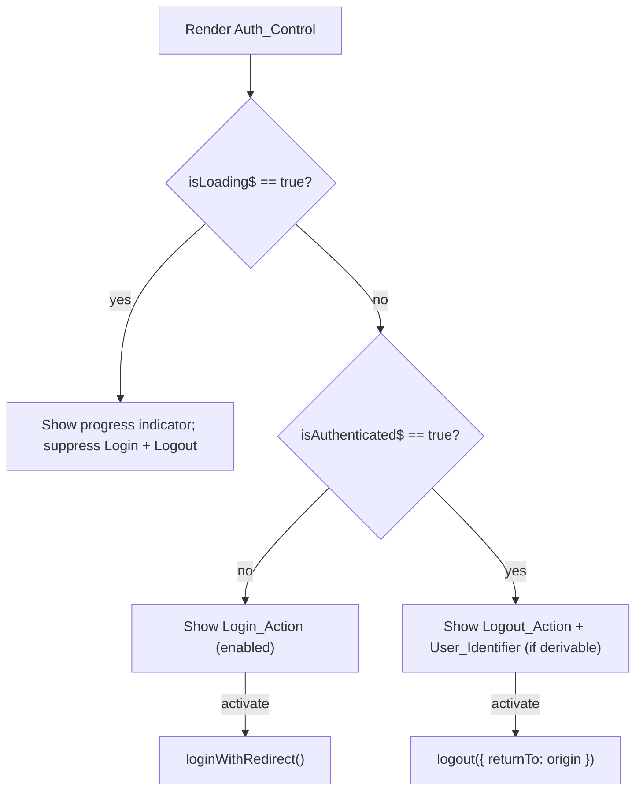

# Design Document

## Overview

This feature adds an authentication control (`Auth_Control`) to the App's top navigation bar (`Nav_Bar`). The control reflects the current Auth0 authentication state and lets the user initiate the login redirect flow or the logout flow. All of the underlying wiring already exists: `provideAuth0(...)` is configured in `app.config.ts`, and `@auth0/auth0-angular`'s `AuthService` is already consumed elsewhere (e.g. `MonthlyServicesViewComponent`) to attach bearer tokens and surface a 401 banner. This feature is therefore a **UI-layer addition** — no provider changes are required.

The design introduces a small, dedicated standalone `AuthButtonComponent` placed inside the existing `Nav_Bar`, driven reactively by `AuthService` observables through the `async` pipe.

### Key research findings

- **`app.config.ts` already provides Auth0.** `provideAuth0` is configured with `domain`, `clientId`, and `authorizationParams: { redirect_uri: window.location.origin, audience }`. No provider changes are needed for login/logout. (Confirmed by reading `music-planner-app/src/app/app.config.ts`.)
- **`AuthService` API surface used here** (from `@auth0/auth0-angular`):
  - `isAuthenticated$: Observable<boolean>`
  - `isLoading$: Observable<boolean>` — `true` until Auth0 finishes resolving state (including on redirect return).
  - `user$: Observable<User | null | undefined>` — `User` exposes optional `name` and `email`.
  - `error$: Observable<Error>` — emits when an authentication error occurs.
  - `loginWithRedirect(): Observable<void>` — starts the redirect to Auth0.
  - `logout(options?): void` — accepts `{ logoutParams: { returnTo } }`.
- **The Monthly View already shares this state.** `MonthlyServicesViewComponent` sets `authError = true` on HTTP 401 and renders the `Auth_Error_Banner`. Because `AuthService` is a singleton, the `Auth_Control` and the banner observe the same authentication state — so once the user logs in and services reload successfully, the banner clears on its own. (Confirmed by reading `monthly-services-view.component.ts` / `.html`.)
- **Existing `AppComponent` is minimal** — standalone, `imports: [RouterOutlet, RouterLink, RouterLinkActive, MatTableModule]`, template is just the nav plus `<router-outlet />`.

### Design decision: dedicated `AuthButtonComponent` vs. inline in `AppComponent`

**Decision: introduce a dedicated standalone `AuthButtonComponent` and place it in the nav.**

Rationale:
- **Separation of concerns / testability.** The `User_Identifier` derivation and the state-driven button logic are easier to unit- and property-test in isolation than if they were embedded in the root shell. `AppComponent` stays a thin layout shell.
- **Reusability.** The control could later be placed elsewhere (e.g. a mobile menu) without duplicating logic.
- **Conventions.** The codebase already favors one-feature-per-folder standalone components (`schedule/`, `monthly-services-view/`, plus nested `components/`). A small `AuthButtonComponent` matches that pattern.
- **Low cost.** The component is tiny; the overhead over inlining is negligible.

The alternative — injecting `AuthService` directly into `AppComponent` and using `async` pipes in the nav template — is viable and marginally less code, but it couples auth presentation logic to the root shell and makes the pure `User_Identifier` logic harder to test in isolation. We prefer the dedicated component.

## Architecture

The `Auth_Control` is a presentational + light-controller component wired to the shared `AuthService`. It reads three observables and renders one of three mutually exclusive states. Actions call back into `AuthService`.

```mermaid
flowchart TD
    AppComponent["AppComponent (Nav_Bar)"] -->|hosts in nav| AuthButton["AuthButtonComponent (Auth_Control)"]
    AuthButton -->|async pipe: isLoading$ / isAuthenticated$ / user$| Auth["AuthService (@auth0/auth0-angular)"]
    AuthButton -->|login()| Auth
    AuthButton -->|logout()| Auth
    Auth -->|redirect| Auth0["Auth0 (external IdP)"]
    Monthly["MonthlyServicesViewComponent"] -->|isAuthenticated$ / 401| Auth
    Monthly -->|shows| Banner["Auth_Error_Banner"]
    Auth0 -->|redirect_uri = window.location.origin| AppComponent
```

State selection (mutually exclusive):



## Components and Interfaces

### `AuthButtonComponent` (new)

- **Location:** `music-planner-app/src/app/auth-button/auth-button.component.{ts,html,css,spec.ts}`
- **Selector:** `app-auth-button`
- **Standalone:** `true`
- **Imports:** `CommonModule` (for `*ngIf`/`async` pipe), `MatButtonModule` (buttons matching Angular Material usage), `MatProgressSpinnerModule` (small inline spinner for the loading state).
- **Injected:** `AuthService` (public or via a getter so the template can bind to its observables through the `async` pipe).

Public members:

```ts
export class AuthButtonComponent {
  // Exposed for template async-pipe binding
  readonly isLoading$: Observable<boolean>;
  readonly isAuthenticated$: Observable<boolean>;
  readonly userIdentifier$: Observable<string | null>; // derived from user$

  // Guards against repeat activation while a redirect is in progress (Req 2.5)
  loginInProgress = false;

  constructor(private auth: AuthService) { /* wire observables */ }

  login(): void;   // Req 2.1: ignores repeat calls while loginInProgress (Req 2.5)
  logout(): void;  // Req 3.1: logout({ logoutParams: { returnTo: window.location.origin } })
}
```

`userIdentifier$` is `auth.user$` piped through the pure derivation function `deriveUserIdentifier` (see Data Models). `null` means "no identifier — show Logout alone".

Template structure (conceptual):

```html
<span class="auth-control">
  <!-- Loading_State: suppress both actions (Req 1.2) -->
  <mat-progress-spinner *ngIf="isLoading$ | async" diameter="20" mode="indeterminate"
                        aria-label="Authenticating"></mat-progress-spinner>

  <ng-container *ngIf="!(isLoading$ | async)">
    <!-- Unauthenticated_State (Req 1.3, 2.x) -->
    <button *ngIf="!(isAuthenticated$ | async)"
            mat-button (click)="login()" [disabled]="loginInProgress">Log In</button>

    <!-- Authenticated_State (Req 1.4, 3.x, 4.x) -->
    <ng-container *ngIf="isAuthenticated$ | async">
      <span class="user-identifier" *ngIf="userIdentifier$ | async as name">{{ name }}</span>
      <button mat-button (click)="logout()">Log Out</button>
    </ng-container>
  </ng-container>
</span>
```

Notes:
- `mat-button` renders a native `<button>`, so keyboard activation (Enter/Space) and pointer activation are handled natively (Req 2.2, 3.2). No custom key handlers needed.
- The `loginInProgress` flag disables the Login button once activated, ignoring repeat activations while the redirect is starting (Req 2.5, 5.3).

### `AppComponent` (modified)

- Add `AuthButtonComponent` to the component's `imports` array.
- Add `<app-auth-button>` inside the existing `<nav class="app-nav">`, after the router links. Optionally wrap the existing links in a container and push the auth control to the right (e.g. `margin-left: auto`) so it sits at the far end of the bar.

Resulting template:

```html
<nav class="app-nav">
  <a routerLink="/" routerLinkActive="active" [routerLinkActiveOptions]="{exact: true}">Schedule</a>
  <a routerLink="/monthly" routerLinkActive="active">Monthly View</a>
  <app-auth-button class="nav-auth"></app-auth-button>
</nav>
<router-outlet />
```

Because the nav is rendered by the always-present root shell, the `Auth_Control` appears on every route (Req 1.1).

### `MonthlyServicesViewComponent` (no functional change required)

The `Auth_Error_Banner` and its `authError` flag remain as-is. Req 5 largely already works:
- The banner stays visible while `authError` is `true` (set on 401). The `Auth_Control` lives in the persistent nav, so the Login button remains visible and keyboard-reachable while the banner shows (Req 5.1).
- After the user logs in via the redirect and returns, `AuthService.isAuthenticated$` becomes `true`, and the next successful `loadServices` clears `authError` (it is reset to `false` at the start of `loadServices` and only re-set on a new 401). The banner is dismissed and the `Auth_Control` shows the `User_Identifier` (Req 5.2).

What (if anything) is needed for Req 5:
- **No new cross-component channel is required** — state sharing is already achieved through the singleton `AuthService`.
- The one gap worth a small, optional enhancement is **Req 5.4 / 1.7 / 2.4 / 3.4 (failure surfacing)**: today the `Auth_Error_Banner` is driven only by HTTP 401, not by an Auth0 SDK auth error (`error$`) or a failed `loginWithRedirect()`/`logout()`. To satisfy "surface authentication failure in the `Auth_Error_Banner`," the design routes auth failures through the same banner. See Error Handling.

### Error/loading state handling summary

| State | Source | Auth_Control renders | Login_Action | Logout_Action |
|-------|--------|----------------------|--------------|---------------|
| Loading | `isLoading$ == true` | spinner only | suppressed | suppressed |
| Unauthenticated | `isLoading$ == false && isAuthenticated$ == false` | Log In | visible + enabled | hidden |
| Authenticated | `isLoading$ == false && isAuthenticated$ == true` | User_Identifier + Log Out | hidden | visible |
| Login redirect starting | `loginInProgress == true` | Log In (disabled) | disabled | hidden |

## Data Models

The only non-trivial logic is deriving the `User_Identifier` from the Auth0 `user$` value. This is a pure function and the primary target for property-based testing.

```ts
// From @auth0/auth0-angular (relevant subset)
interface User {
  name?: string;
  email?: string;
  // ...other OIDC claims
}

/**
 * Derives the User_Identifier per Requirement 4.
 * - Non-empty name  -> name          (4.1)
 * - Else non-empty email -> email    (4.2)
 * - Else -> null (no identifier)     (4.3)
 * - user null/undefined -> null      (4.4)
 * "Non-empty" means the value contains at least one non-whitespace character.
 */
export function deriveUserIdentifier(user: User | null | undefined): string | null {
  if (!user) return null;
  const name = user.name?.trim();
  if (name) return name;
  const email = user.email?.trim();
  if (email) return email;
  return null;
}
```

Precedence rule (total function over the input space):

| `user` | `name` (non-empty?) | `email` (non-empty?) | Result |
|--------|---------------------|----------------------|--------|
| null/undefined | — | — | `null` |
| present | yes | — | `name` |
| present | no | yes | `email` |
| present | no | no | `null` |

## Correctness Properties

*A property is a characteristic or behavior that should hold true across all valid executions of a system — essentially, a formal statement about what the system should do. Properties serve as the bridge between human-readable specifications and machine-verifiable correctness guarantees.*

The bulk of this feature is UI state rendering wired to Auth0 (best covered by component/example tests). However, the `User_Identifier` derivation (Requirement 4) is a **pure total function over a large input space** (arbitrary strings, whitespace, missing fields, null user), which makes it an ideal property-based testing target.

### Property 1: Name takes precedence when non-empty

*For any* user object whose `name` contains at least one non-whitespace character, `deriveUserIdentifier` SHALL return that `name` (trimmed), regardless of the `email` value.

**Validates: Requirements 4.1**

### Property 2: Email is used only when name is empty and email is non-empty

*For any* user object whose `name` is missing or entirely whitespace AND whose `email` contains at least one non-whitespace character, `deriveUserIdentifier` SHALL return that `email` (trimmed).

**Validates: Requirements 4.2**

### Property 3: No identifier when nothing usable is present

*For any* input that is `null`/`undefined`, OR a user object whose `name` and `email` are both missing or entirely whitespace, `deriveUserIdentifier` SHALL return `null`.

**Validates: Requirements 4.3, 4.4**

### Property 4: Result is always name, email, or null (totality)

*For any* input (including null/undefined users and arbitrary string values for `name`/`email`), `deriveUserIdentifier` SHALL return either the trimmed `name`, the trimmed `email`, or `null` — never an empty/whitespace-only string and never throwing.

**Validates: Requirements 4.1, 4.2, 4.3, 4.4**

> Property-reflection note: earlier candidate properties "returns name when present" and "never returns whitespace" overlapped with Properties 1 and 4. They were consolidated: Property 4 subsumes the "never whitespace / never throws" guarantees across the whole input space, while Properties 1–3 pin down each branch of the precedence rule.

## Error Handling

Auth failures must return the control to the correct state and surface a message through the existing `Auth_Error_Banner` (Req 1.7, 2.4, 3.4, 5.4). The banner lives in `MonthlyServicesViewComponent`; the recommended approach keeps that ownership and lets the shared `AuthService` state drive it, with a small addition for SDK-level auth errors.

- **Login redirect fails to initiate (Req 2.4):** `loginWithRedirect()` returns an Observable; subscribe and handle `error`. On error, reset `loginInProgress = false` (control stays in Unauthenticated_State because `isAuthenticated$` never changed) and signal a login failure. Because the redirect never happens, the user remains on the current view; if that view is the Monthly View, the banner should read that login could not be started.
- **Logout fails to initiate (Req 3.4):** `logout()` is fire-and-forget in the SDK; wrap the call in `try/catch`. On throw, the control stays in Authenticated_State (`isAuthenticated$` unchanged) and a logout-failure message is surfaced.
- **Auth0 reports an authentication failure / return from Auth0 fails or is cancelled (Req 1.7, 5.4):** subscribe to `AuthService.error$`. When it emits, the SDK leaves `isAuthenticated$` at `false`, so the `Auth_Control` automatically returns to Unauthenticated_State. The failure needs to be reflected in the `Auth_Error_Banner`.

**How the banner is driven by auth failures (recommended):** add a lightweight shared signal so auth errors can raise the banner without HTTP traffic. Options, in order of preference:

1. **Have `MonthlyServicesViewComponent` also subscribe to `AuthService.error$`** (and optionally a shared failure message) and set `authError = true` with an appropriate message when an auth error occurs. This is the smallest change, keeps banner ownership in the Monthly View, and requires no new service. The `Auth_Control` itself only manages `loginInProgress` and delegates state to `AuthService`.
2. If login/logout *initiation* errors (which do not flow through `error$`) also need to raise the banner, introduce a tiny injectable `AuthErrorState` service (a `BehaviorSubject<string | null>`) that `AuthButtonComponent` writes to on initiation failure and `MonthlyServicesViewComponent` reads to show the banner. This avoids `AppComponent`↔child coupling.

Given the requirements, option 1 covers the return-from-Auth0 failure cases (the common ones in Req 5.4), and option 2 covers the rarer initiation-failure cases (Req 2.4, 3.4). Implement option 1 first; add option 2 only if initiation-failure surfacing is required.

Guard behavior:
- `loginInProgress` prevents duplicate `loginWithRedirect()` calls between click and navigation (Req 2.5, 5.3). It is reset if the redirect fails to initiate.

## Testing Strategy

A dual approach is used, but property-based testing is scoped only to the pure derivation logic; the rest is UI behavior best covered by Angular component tests.

### Property-based tests (Karma + Jasmine + `fast-check`)

- **Library:** [`fast-check`](https://fast-check.dev/) (the standard property-based testing library for the JS/TS ecosystem). Do not hand-roll property testing.
- **Scope:** `deriveUserIdentifier` (Properties 1–4).
- **Configuration:** each property test runs a minimum of **100 iterations** (`fc.assert(fc.property(...), { numRuns: 100 })`).
- **Generators:** arbitrary strings including empty, whitespace-only, and non-whitespace content for `name`/`email`; plus `null`/`undefined` user; plus objects missing either field. These generators cover the edge cases in Req 4 (missing fields, whitespace) without separate example tests.
- **Tagging:** each property test is tagged with a comment referencing the design property, e.g.
  `// Feature: auth0-login-button, Property 1: Name takes precedence when non-empty`

### Unit / component tests (Karma + Jasmine, `.spec.ts`)

`AuthButtonComponent` state rendering, using a mocked `AuthService` whose observables are driven with `BehaviorSubject`s:

- **Loading_State (Req 1.2):** `isLoading$ = true` → neither Log In nor Log Out is rendered; a spinner is shown.
- **Unauthenticated_State (Req 1.3, 2.3):** `isLoading$ = false`, `isAuthenticated$ = false` → Log In visible and enabled; no Log Out, no identifier.
- **Authenticated_State (Req 1.4):** `isAuthenticated$ = true` → Log Out visible; Login hidden; identifier shown when derivable.
- **Login action (Req 2.1):** clicking Log In calls `auth.loginWithRedirect`.
- **Repeat-activation guard (Req 2.5):** second click while `loginInProgress` does not call `loginWithRedirect` again; button is disabled.
- **Logout action (Req 3.1):** clicking Log Out calls `auth.logout` with `{ logoutParams: { returnTo: window.location.origin } }`.
- **Keyboard/pointer activation (Req 2.2, 3.2):** covered by using native `mat-button` `<button>` elements; a test asserts the rendered element is a `<button>` (native Enter/Space semantics) and that a click handler fires.
- **Identifier binding (Req 4.1–4.4):** feed representative `user$` values and assert the rendered identifier matches `deriveUserIdentifier`.

Error handling:
- **Login initiation failure (Req 2.4):** mock `loginWithRedirect` to return a throwing Observable; assert `loginInProgress` resets and a failure is signalled.
- **Logout initiation failure (Req 3.4):** mock `logout` to throw; assert state remains Authenticated and a failure is signalled.
- **Auth error surfaces banner (Req 1.7, 5.4):** in `MonthlyServicesViewComponent`, emit on the mocked `error$` and assert `authError` becomes `true` with the expected message.

Integration / route presence:
- **Nav presence (Req 1.1):** `AppComponent` test asserts `<app-auth-button>` renders within `.app-nav`.
- **Banner + login reachability (Req 5.1, 5.2):** component test with `authError = true` asserts the banner and (via the always-present nav) the Login button coexist; simulate `isAuthenticated$` → `true` then a successful reload and assert `authError` clears.

Why PBT is limited here: state selection and button rendering are UI concerns (behavior driven by observable emissions, not by input variation), and login/logout are side-effect-only SDK calls — both are better covered by example/component tests. Only `deriveUserIdentifier` has a meaningful "for all inputs" specification.
