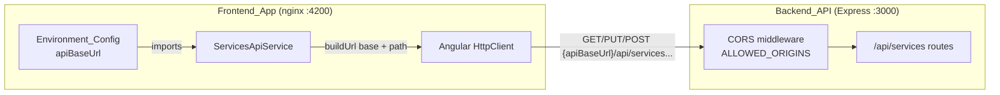

# Design Document

## Overview

Today the Angular frontend (`music-planner-app`) calls the backend using hardcoded relative paths built directly into `ServicesApiService`:

- `GET /api/services`
- `PUT /api/services/{serviceId}`
- `POST /api/services`

Relative paths only resolve correctly when the frontend and API share an origin, or when a reverse proxy forwards `/api` to the backend. In the docker-compose deployment neither is true: the Angular app is served by nginx on port `4200` and the API runs on port `3000` as a separate origin, with no `/api` proxy configured. As a result every request 404s (or hits the nginx SPA fallback) in that topology.

This design introduces a single configurable value, `apiBaseUrl`, on the Angular `environment` object. `ServicesApiService` prepends this value to each API path when constructing request URLs. The key behaviors are:

- **Backward compatible**: an empty `apiBaseUrl` yields exactly the relative paths used today, so same-origin and proxied deployments are unaffected.
- **Origin-aware**: a non-empty `apiBaseUrl` such as `http://localhost:3000` produces absolute URLs that reach the API's own origin.
- **Slash-safe**: a trailing slash on `apiBaseUrl` (e.g. `http://localhost:3000/`) must not create a doubled slash (`http://localhost:3000//api/services`).
- **No new proxy**: cross-origin requests rely on the API's existing CORS allow-list (`ALLOWED_ORIGINS`, already including `http://localhost:4200`), not on a new nginx or dev-server proxy.

The change is deliberately small and localized: two environment files, one service, and one spec file. No component, model, or API contract changes.

## Architecture



The only structural addition is a private URL-composition step inside `ServicesApiService`. Everything else — token acquisition via `AuthService.getAccessTokenSilently()`, the `Authorization: Bearer {token}` header, query params, and request bodies — stays exactly as it is.

**URL composition rule.** Given `base = environment.apiBaseUrl` and an `API_Path` that always begins with `/api/...`:

1. If `base` is an empty string, the Request_URL is the `API_Path` unchanged (relative path, current behavior).
2. Otherwise, strip a single trailing `/` from `base` (if present), then concatenate `base + API_Path`.

Because every `API_Path` already starts with a leading slash, stripping the trailing slash from the base is sufficient to guarantee exactly one slash at the join point. This handles the three inputs that matter:

| `apiBaseUrl` | `API_Path` | Request_URL |
|---|---|---|
| `''` | `/api/services` | `/api/services` |
| `http://localhost:3000` | `/api/services` | `http://localhost:3000/api/services` |
| `http://localhost:3000/` | `/api/services` | `http://localhost:3000/api/services` |

## Components and Interfaces

### Environment_Config

Both environment files gain an `apiBaseUrl: string` field alongside the existing fields, which remain unchanged.

- `environment.ts` (development): `apiBaseUrl: 'http://localhost:3000'` — points the dev build at the local API container/process on port 3000, enabling local development without a proxy.
- `environment.prod.ts` (production): `apiBaseUrl: ''` — an empty string preserves relative-path behavior by default. This is the safe backward-compatible default for a same-origin or proxied production topology; operators who deploy the API on a distinct origin set this to that origin's URL at build time.

The exported object shape becomes:

```typescript
export const environment = {
  production: boolean,
  apiBaseUrl: string,      // new
  auth0Domain: string,
  auth0ClientId: string,
  auth0Audience: string
};
```

### ServicesApiService

The service keeps its public interface identical. Internally it reads `environment.apiBaseUrl` and routes every path through a small private helper before passing it to `HttpClient`.

```typescript
import { environment } from '../../../environments/environment';

private buildUrl(path: string): string {
  const base = environment.apiBaseUrl;
  if (!base) {
    return path;                       // empty base -> relative path (unchanged behavior)
  }
  return base.replace(/\/$/, '') + path; // strip one trailing slash, then join
}
```

Public methods change only in the URL argument passed to `HttpClient`:

| Method | Before | After |
|---|---|---|
| `getServices(from, to)` | `http.get('/api/services', ...)` | `http.get(this.buildUrl('/api/services'), ...)` |
| `updateServiceSlots(id, slots)` | `http.put(`/api/services/${id}`, ...)` | `http.put(this.buildUrl(`/api/services/${id}`), ...)` |
| `createService(payload)` | `http.post('/api/services', ...)` | `http.post(this.buildUrl('/api/services'), ...)` |

The `withToken` wrapper, headers, `params` (`from`/`to`), and request bodies (`{ slots }`, `payload`) are untouched.

### Backend_API (no change)

The Express API already configures CORS with an allow-list that includes `http://localhost:4200` and any origins from `ALLOWED_ORIGINS`, and it allows the `Authorization` header. Cross-origin requests from the frontend are authorized by this existing configuration. No code change is required in `music-planner-api`; this component is documented here only to make the cross-origin dependency explicit.

## Data Models

No new domain data models are introduced. The only data-shape change is the addition of one field to the environment configuration object.

```typescript
interface EnvironmentConfig {
  production: boolean;
  apiBaseUrl: string;   // origin (and optional path prefix) of the Backend_API; '' = relative paths
  auth0Domain: string;
  auth0ClientId: string;
  auth0Audience: string;
}
```

`apiBaseUrl` is a plain string. Valid values include:
- `''` — relative-path mode (backward compatible).
- An origin such as `http://localhost:3000` or `https://api.example.com`.
- An origin with a trailing slash such as `http://localhost:3000/` — normalized during URL composition.

All existing request/response models (`Service`, `SlotInput`, `CreateServicePayload`, etc.) are unchanged.

## Correctness Properties

*A property is a characteristic or behavior that should hold true across all valid executions of a system — essentially, a formal statement about what the system should do. Properties serve as the bridge between human-readable specifications and machine-verifiable correctness guarantees.*

The testable logic in this feature is the pure URL-composition rule inside `ServicesApiService`. Its behavior varies meaningfully across inputs (empty vs. non-empty base, trailing slash, different paths and service IDs), which makes it well suited to property-based testing. The remaining acceptance criteria are static configuration facts (1.1–1.4, 4.1), reliance on external CORS behavior (4.2), or meta requirements about the test suite (5.1, 5.3); those are covered by compilation, configuration review, and example/integration checks rather than properties.

Requirements 2.1, 2.2, 2.3, 3.2, and 3.3 all describe the same composition rule applied through different HTTP methods, so they are consolidated into a single comprehensive property (Property 1). Requirements 2.5 and 2.6 (params and bodies preserved) are asserted alongside that property. Requirement 3.1 (empty-base identity) is a distinct branch and gets its own property. The Bearer-token invariant (2.4, 5.2) is preserved from the existing suite as its own property.

### Property 1: Non-empty base URL is prepended with exactly one join slash

*For any* non-empty `apiBaseUrl` (with or without a trailing slash) and *any* API_Path (`/api/services` or `/api/services/{serviceId}`), the Request_URL passed to `HttpClient` SHALL begin with the base URL stripped of a single trailing slash, SHALL end with the API_Path, and SHALL contain no duplicated slash at the join between them. For the get-services request the `from`/`to` query params SHALL be preserved unchanged, and for the update/create requests the request body SHALL be preserved unchanged.

**Validates: Requirements 2.1, 2.2, 2.3, 2.5, 2.6, 3.2, 3.3**

### Property 2: Empty base URL yields the relative path unchanged

*For any* API_Path, when `apiBaseUrl` is an empty string, the Request_URL passed to `HttpClient` SHALL equal the API_Path exactly (relative path), preserving today's behavior.

**Validates: Requirements 3.1**

### Property 3: Bearer token is attached to every request

*For any* token string returned by the auth service, every request issued by `ServicesApiService` (get-services, update-service-slots, create-service) SHALL carry the header `Authorization: Bearer {token}`, regardless of the configured base URL.

**Validates: Requirements 2.4, 5.2**

## Error Handling

This feature is a pure string-composition change and introduces no new runtime failure modes of its own. Error handling considerations:

- **Empty base URL**: not an error — treated as an explicit, supported mode that yields relative paths (Property 2).
- **Trailing slash**: not an error — normalized during composition so no duplicate slash is produced (Property 1).
- **HTTP/transport errors** (network failure, non-2xx responses): unchanged. These continue to surface through the returned `Observable`'s error channel exactly as before; callers handle them as they do today. No new try/catch or interception is added.
- **CORS rejections** (cross-origin request blocked by the browser because the frontend origin is not in `ALLOWED_ORIGINS`): surfaced by the browser/`HttpClient` as an HTTP error on the Observable. The fix for this is operational — add the frontend origin to the API's `ALLOWED_ORIGINS` — not a code change in the frontend. This dependency is documented so operators know where to look when a cross-origin request fails.
- **Malformed `apiBaseUrl`** (a garbage string): out of scope. `apiBaseUrl` is a build-time configuration value controlled by developers/operators, not user input, so it is not validated at runtime. A bad value will simply produce a request URL that fails at the transport layer, visible during the build's own smoke check.

## Testing Strategy

The feature uses a dual approach: property-based tests for the URL-composition logic and its invariants, and lightweight example/smoke checks for configuration and setup facts.

### Property-based tests

Property-based testing is appropriate here because the URL-composition rule is a pure transformation with universal properties over a large input space (arbitrary base URLs, trailing slashes, paths, and service IDs).

- Library: **fast-check** (already used in the existing `services-api.service.spec.ts`).
- Each property test runs a **minimum of 100 iterations** (`{ numRuns: 100 }`).
- Each property test is tagged with a comment referencing its design property, using the format: **Feature: configurable-api-base-url, Property {number}: {property_text}**.
- Requests are asserted using `HttpTestingController` (`HttpClientTestingModule`), matching requests by their composed URL.

Property-to-test mapping:

- **Property 1** — Generate non-empty base URLs (including variants with a trailing slash) and, for update requests, arbitrary service IDs. For each of `getServices`, `updateServiceSlots`, and `createService`, assert the intercepted request URL starts with the normalized base, ends with the expected path, and contains no `//` at the join. In the same test, assert `from`/`to` params (get) and request bodies (update/create) are preserved. Because `environment.apiBaseUrl` is imported statically, the test either overrides it (e.g. via a spy/`Object.defineProperty` or by testing the `buildUrl` composition directly through the public methods with a stubbed environment) or exercises composition through a small injectable seam — implemented at task time without changing the public API.
- **Property 2** — With base set to `''`, generate the API paths and assert the intercepted request URL equals the relative path exactly.
- **Property 3** — Retain and keep green the existing token property tests (generate arbitrary token strings, assert `Authorization: Bearer {token}` on each request). Extend the URL matchers so they match the base-URL-prefixed URLs used during testing.

### Example / unit tests

- A small example test confirming the three canonical composition cases from the Architecture table (`''`, `http://localhost:3000`, `http://localhost:3000/`) each produce the expected URL. This complements the property test with concrete, readable cases.

### Smoke / configuration checks (not PBT)

- **Requirements 1.1–1.4**: verified primarily by TypeScript compilation (the `environment` shape now includes `apiBaseUrl: string` and retains the existing fields) plus configuration review of `environment.ts` and `environment.prod.ts`.
- **Requirement 4.1**: architecture/config review confirming no nginx or dev-server proxy is introduced.
- **Requirement 5.3**: run `npm test` (Karma + Jasmine) and confirm the suite passes with the updated assertions. Note: `npm test` opens a browser and runs in watch mode by default; run it in single-run mode (e.g. `ng test --watch=false --browsers=ChromeHeadless`) for a one-shot verification.

### Integration (not PBT)

- **Requirement 4.2**: cross-origin authorization depends on the API's existing CORS `ALLOWED_ORIGINS` config (which already includes `http://localhost:4200`). This is external Express behavior, verified by an optional manual or integration check that a cross-origin request from the configured frontend origin is authorized — not by property tests.
