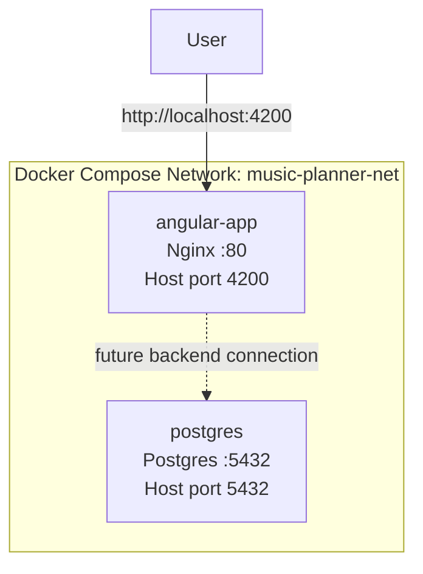
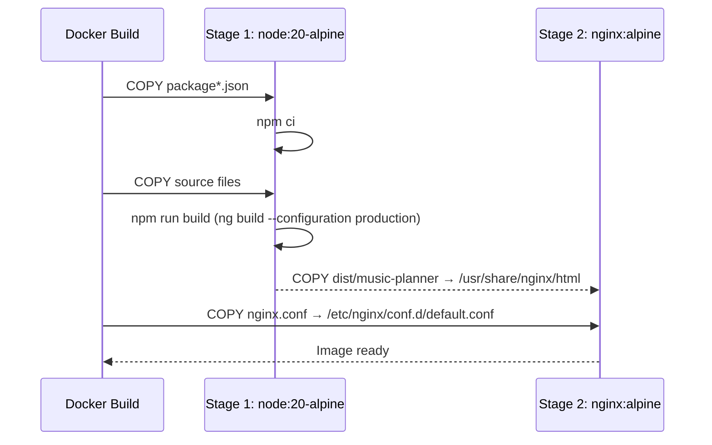
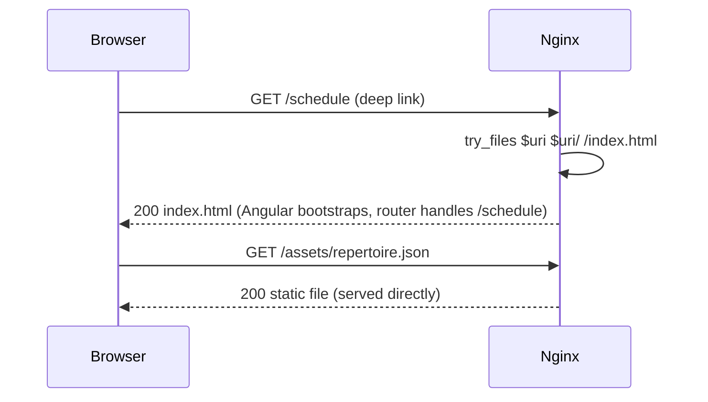

# Design Document: Docker Containerisation

## Overview

Containerise the `music-planner` Angular 17 SPA using a multi-stage Docker build (Node build → Nginx serve) and wire it together with a Postgres service in a Docker Compose file. The Angular app is frontend-only today; Postgres is included in the compose setup for future backend use.

---

## Architecture



The Angular app is served as static files by Nginx. Postgres runs as a sidecar service on the same Docker network, ready for a future backend to connect to. There is no direct runtime dependency between the two services today.

---

## Sequence Diagrams

### Build & Serve Flow (Docker Build)



### Request Handling Flow (Runtime)



---

## Components and Interfaces

### Component 1: Dockerfile (multi-stage)

**Purpose**: Produce a minimal, production-ready image containing only Nginx and the compiled Angular static assets.

**Stages**:

| Stage | Base Image | Responsibility |
|-------|-----------|----------------|
| `builder` | `node:20-alpine` | Install deps, run `ng build --configuration production` |
| `runner` | `nginx:alpine` | Serve static files from `dist/music-planner` |

**Key decisions**:
- `node:20-alpine` keeps the build stage small and avoids Debian bloat
- Only the `dist/music-planner` folder is copied to the final image — no Node, no source code
- `.dockerignore` excludes `node_modules`, `.angular/cache`, and `dist` to avoid cache-busting and bloated build context

### Component 2: nginx.conf

**Purpose**: Configure Nginx to correctly serve an Angular SPA with HTML5 `pushState` routing.

**Critical behaviour**:
- `try_files $uri $uri/ /index.html` — falls back to `index.html` for any unmatched path, letting Angular's router handle it client-side
- `gzip on` with appropriate MIME types for JS/CSS assets
- Cache headers: long-lived cache for hashed assets (`*.js`, `*.css`), no-cache for `index.html`

**Interface** (nginx server block):

```nginx
server {
    listen 80;
    root /usr/share/nginx/html;
    index index.html;

    # SPA fallback
    location / {
        try_files $uri $uri/ /index.html;
    }

    # Cache hashed static assets aggressively
    location ~* \.(js|css|png|jpg|ico|woff2?)$ {
        expires 1y;
        add_header Cache-Control "public, immutable";
    }

    # Never cache index.html
    location = /index.html {
        add_header Cache-Control "no-cache, no-store, must-revalidate";
    }

    gzip on;
    gzip_types text/plain text/css application/javascript application/json;
}
```

### Component 3: docker-compose.yml

**Purpose**: Orchestrate the Angular app container and Postgres container on a shared network.

**Services**:

| Service | Image | Port mapping | Depends on |
|---------|-------|-------------|------------|
| `angular-app` | Built from `./Dockerfile` | `4200:80` | — |
| `postgres` | `postgres:16-alpine` | `5432:5432` | — |

**Interface** (service definitions):

```yaml
services:
  angular-app:
    build: .
    ports:
      - "4200:80"
    networks:
      - music-planner-net

  postgres:
    image: postgres:16-alpine
    ports:
      - "5432:5432"
    environment:
      POSTGRES_DB: ${POSTGRES_DB:-music_planner}
      POSTGRES_USER: ${POSTGRES_USER:-postgres}
      POSTGRES_PASSWORD: ${POSTGRES_PASSWORD}
    volumes:
      - postgres_data:/var/lib/postgresql/data
    networks:
      - music-planner-net

networks:
  music-planner-net:

volumes:
  postgres_data:
```

---

## Data Models

### Environment Variables

Postgres credentials are injected via environment variables, never hardcoded. A `.env` file (gitignored) provides values locally; CI/CD injects them as secrets.

| Variable | Default | Required | Description |
|----------|---------|----------|-------------|
| `POSTGRES_DB` | `music_planner` | No | Database name |
| `POSTGRES_USER` | `postgres` | No | Postgres username |
| `POSTGRES_PASSWORD` | — | **Yes** | Postgres password (no default — must be set) |

`.env.example` (committed to repo):
```
POSTGRES_DB=music_planner
POSTGRES_USER=postgres
POSTGRES_PASSWORD=changeme
```

`.env` (gitignored — actual secrets):
```
POSTGRES_PASSWORD=your_actual_password_here
```

### .dockerignore

Prevents unnecessary files from entering the build context, which keeps builds fast and avoids cache invalidation from unrelated changes:

```
node_modules
dist
.angular
.git
*.md
.env
.env.*
```

---

## Error Handling

### Scenario 1: Missing POSTGRES_PASSWORD

**Condition**: `docker compose up` run without a `.env` file or `POSTGRES_PASSWORD` set  
**Response**: Postgres container fails to start with an error: `POSTGRES_PASSWORD` is not set  
**Recovery**: Create a `.env` file from `.env.example` and set a password before running compose

### Scenario 2: Angular build fails inside Docker

**Condition**: `npm run build` fails during the Docker build stage (e.g. TypeScript error)  
**Response**: `docker build` exits non-zero; no image is produced  
**Recovery**: Fix the build error locally (`npm run build`) before re-running `docker build`

### Scenario 3: Deep-link 404 without SPA fallback

**Condition**: User navigates directly to a route like `/schedule` without the `try_files` fallback  
**Response**: Nginx returns 404 (default behaviour without SPA config)  
**Recovery**: Ensured by the `try_files $uri $uri/ /index.html` directive in `nginx.conf`

### Scenario 4: Port conflict on host

**Condition**: Host already has something running on port 4200 or 5432  
**Response**: `docker compose up` fails with "address already in use"  
**Recovery**: Change the host-side port mapping in `docker-compose.yml` (e.g. `4201:80`)

---

## Testing Strategy

### Manual Smoke Tests

After `docker compose up --build`:

1. `curl http://localhost:4200` → returns `index.html` with status 200
2. `curl http://localhost:4200/schedule` → returns `index.html` (SPA fallback working)
3. `curl http://localhost:4200/assets/repertoire.json` → returns the JSON file
4. `docker compose exec postgres psql -U postgres -c '\l'` → lists databases including `music_planner`

### Build Verification

- `docker build -t music-planner-test .` completes without error
- Final image size should be under ~50MB (Nginx alpine + static assets only)
- `docker image inspect music-planner-test` confirms no Node.js in the final layer

### Property: SPA Routing Correctness

For any valid Angular route path `p`:
- A GET request to `http://localhost:4200/{p}` must return HTTP 200 with `Content-Type: text/html`
- The response body must be `index.html`

**Validates: Requirement 2.1**

### Property: Static Asset Caching

For any hashed asset file `f` (matching `*.js` or `*.css`):
- Response headers must include `Cache-Control: public, immutable`
- `index.html` must always have `Cache-Control: no-cache`

**Validates: Requirement 2.2, 2.3**

---

## Performance Considerations

- Multi-stage build ensures the final image contains zero Node.js runtime or source files — typical final image size ~25–40MB
- Angular production build enables tree-shaking, minification, and output hashing by default
- Nginx `gzip` compression reduces transfer size for JS/CSS bundles
- Named Docker volume `postgres_data` persists database state across container restarts

---

## Security Considerations

- `POSTGRES_PASSWORD` has no default value in `docker-compose.yml` — compose will refuse to start if unset, preventing accidental empty-password deployments
- `.env` is gitignored; `.env.example` with placeholder values is committed instead
- The Angular container runs Nginx as a non-root user (default in `nginx:alpine`)
- Postgres is only accessible on the internal `music-planner-net` network plus the mapped host port — in production, remove the `5432:5432` port mapping to avoid exposing Postgres to the host network

---

## Dependencies

| Dependency | Version | Purpose |
|-----------|---------|---------|
| `node` (Docker image) | `20-alpine` | Build stage: install deps and compile Angular |
| `nginx` (Docker image) | `alpine` | Serve compiled static assets |
| `postgres` (Docker image) | `16-alpine` | Database service (future use) |
| Docker Engine | ≥24 | Container runtime |
| Docker Compose | ≥2.20 (Compose V2) | Multi-service orchestration |
