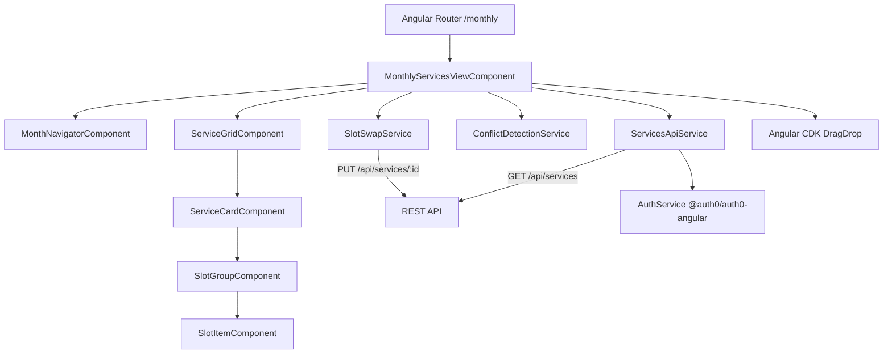

# Design Document: Monthly Services View

## Overview

The Monthly Services View is a new standalone Angular 17 component at `/monthly` that fetches worship services from the REST API for a selected month, displays them in a two-column alternating layout with songs grouped by slot category, detects and highlights song conflicts across a ±365-day window, and supports drag-and-drop swapping of song slots between services.

Auth0 authentication is provided by `@auth0/auth0-angular`, which must be installed and configured in the app. The component follows the same standalone pattern as the existing `schedule/` component.

---

## Architecture



### File Structure

```
src/app/monthly-services-view/
  monthly-services-view.component.ts      # Root page component
  monthly-services-view.component.html
  monthly-services-view.component.css
  monthly-services-view.component.spec.ts
  components/
    month-navigator/
      month-navigator.component.ts
      month-navigator.component.html
      month-navigator.component.css
    service-card/
      service-card.component.ts
      service-card.component.html
      service-card.component.css
    slot-item/
      slot-item.component.ts
      slot-item.component.html
      slot-item.component.css
  services/
    services-api.service.ts               # HTTP calls to GET/PUT /api/services
    conflict-detection.service.ts         # Pure conflict computation logic
    slot-swap.service.ts                  # Orchestrates drag-drop PUT calls + revert
  models/
    service.model.ts                      # TypeScript interfaces matching API shapes
```

---

## Components and Interfaces

### MonthlyServicesViewComponent (page root)

Owns the selected month state, triggers API fetches, holds the loaded services array, and passes data down to child components. Also owns the CDK drag-drop list connections.

**Responsibilities:**
- Initialize selected month to current month on `ngOnInit`
- Fetch services for the display month (current month only) and the conflict window (±12 months)
- Pass display services + conflict map to `ServiceCardComponent`
- Handle drag-drop events from CDK and delegate to `SlotSwapService`
- Show loading spinner and error banners

**Template structure:**
```
<app-month-navigator>
<mat-spinner *ngIf="loading">
<div class="error-banner" *ngIf="error">
<div class="service-grid">
  <div class="grid-row" *ngFor="each pair of servicePairs">
    <app-service-card [service]="pair[0]" [conflictMap]="conflictMap" cdkDropList>
    <app-service-card [service]="pair[1]" [conflictMap]="conflictMap" cdkDropList>
```

---

### MonthNavigatorComponent

Displays the current month label and previous/next buttons.

**Inputs:** `selectedMonth: moment.Moment`
**Outputs:** `monthChange: EventEmitter<moment.Moment>`

```html
<button mat-icon-button (click)="prev()">‹</button>
<span>{{ selectedMonth | date:'MMMM yyyy' }}</span>
<button mat-icon-button (click)="next()">›</button>
```

---

### ServiceCardComponent

Displays a single service card. Groups slots by category and renders them. Each slot is a CDK drag item.

**Inputs:**
- `service: ServiceViewModel` — the service to display
- `conflictMap: ConflictMap` — pre-computed conflict data keyed by slot id
- `allDropLists: CdkDropList[]` — connected drop lists for cross-service drag-drop

**Template structure:**
```
<mat-card>
  <mat-card-header>{{ service.serviceDate }} — {{ service.serviceType }}</mat-card-header>
  <div class="slot-group" *ngFor="let group of slotGroups">
    <div class="category-label">{{ group.category }}</div>
    <app-slot-item *ngFor="let slot of group.slots" [slot]="slot" [conflict]="conflictMap[slot.id]" cdkDrag>
```

---

### SlotItemComponent

Renders a single song slot with conflict colour indicator and tooltip.

**Inputs:**
- `slot: ServiceSlotViewModel`
- `conflict: SlotConflictStatus | null`

Applies CSS class based on conflict severity: `conflict-red`, `conflict-yellow`, `conflict-green`.

---

### ServicesApiService

Handles all HTTP communication with the API.

```typescript
@Injectable({ providedIn: 'root' })
export class ServicesApiService {
  getServices(from: string, to: string): Observable<Service[]>
  updateServiceSlots(serviceId: string, slots: SlotInput[]): Observable<Service>
}
```

Uses `AuthService.getAccessTokenSilently()` from `@auth0/auth0-angular` to obtain a Bearer token, then attaches it via an `HttpInterceptor` or inline `switchMap`.

---

### ConflictDetectionService

Pure, stateless service containing the conflict computation algorithm. No HTTP calls.

```typescript
@Injectable({ providedIn: 'root' })
export class ConflictDetectionService {
  buildConflictMap(allServices: Service[]): ConflictMap
}
```

Returns a `ConflictMap` (keyed by slot id) that the page component passes to service cards.

---

### SlotSwapService

Orchestrates the two-PUT swap operation with optimistic UI update and rollback on failure.

```typescript
@Injectable({ providedIn: 'root' })
export class SlotSwapService {
  swap(
    sourceSlot: ServiceSlotViewModel,
    targetSlot: ServiceSlotViewModel,
    sourceService: ServiceViewModel,
    targetService: ServiceViewModel
  ): Observable<[Service, Service]>
}
```

---

## Data Models

### API response shapes (from `models/service.model.ts`)

```typescript
export interface Song {
  number: string;
  hymnal: string;
  translationOf?: { number: string };
}

export interface SlotTemplate {
  slotKey: string;
  category: 'orchestra' | 'choir' | 'congregation';
  displayOrder: number;
}

export interface ServiceSlot {
  id: string;
  serviceId: string;
  slotTemplateId: string;
  songId: string | null;
  slotTemplate: SlotTemplate;
  song: Song | null;
}

export interface Service {
  id: string;
  congregationId: string;
  serviceDate: string;   // YYYY-MM-DD
  serviceType: string;
  serviceSlots: ServiceSlot[];
}

export interface SlotInput {
  slotKey: string;
  songId: string | null;
}
```

### View models (enriched for the template)

```typescript
export interface SlotConflictStatus {
  severity: 'red' | 'yellow' | 'green' | null;
  conflictingDates: Array<{ date: string; serviceType: string }>;
}

// ConflictMap: slot.id -> SlotConflictStatus
export type ConflictMap = Record<string, SlotConflictStatus>;

export interface ServiceSlotViewModel extends ServiceSlot {
  canonicalNumber: string;  // translationOf.number ?? song.number
}

export interface SlotGroup {
  category: 'orchestra' | 'choir' | 'congregation';
  slots: ServiceSlotViewModel[];
}

export interface ServiceViewModel extends Service {
  serviceSlots: ServiceSlotViewModel[];
  slotGroups: SlotGroup[];  // pre-grouped, sorted by displayOrder
}
```

### Month navigation state

```typescript
interface MonthState {
  displayMonth: moment.Moment;   // the month shown in the view
  displayFrom: string;           // first day of displayMonth (YYYY-MM-DD)
  displayTo: string;             // last day of displayMonth (YYYY-MM-DD)
  conflictFrom: string;          // displayMonth - 12 months (YYYY-MM-DD)
  conflictTo: string;            // displayMonth + 12 months (YYYY-MM-DD)
}
```

---

## Conflict Detection Algorithm

The algorithm mirrors the logic in the existing `schedule.component.ts` `calculateConflicts` method, adapted for the API data shape.

### Canonical number resolution

For each slot, the canonical song number used for matching is:
```
canonicalNumber = slot.song.translationOf?.number ?? slot.song.number
```

### Algorithm (ConflictDetectionService.buildConflictMap)

```
Input: allServices: Service[]   (covers ±12 months around the display month)

1. Build a flat list of all occupied slots across all services:
   songOccurrences = allServices
     .flatMap(svc => svc.serviceSlots
       .filter(slot => slot.songId !== null)
       .map(slot => ({
         slotId: slot.id,
         serviceId: svc.id,
         serviceDate: svc.serviceDate,
         serviceType: svc.serviceType,
         canonicalNumber: slot.song.translationOf?.number ?? slot.song.number
       }))
     )

2. For each occurrence O in songOccurrences:
   a. Find all other occurrences P where:
      - P.canonicalNumber === O.canonicalNumber
      - NOT (P.serviceId === O.serviceId AND P.slotId === O.slotId)
        (same service, same slot = skip; same service, different slot = include per Req 7.7)
   b. For each matching P, compute:
      diffDays = |daysBetween(O.serviceDate, P.serviceDate)|
   c. Classify:
      - diffDays <= 56  → red conflict
      - 57 <= diffDays <= 90  → yellow (quarter conflict)
      - 91 <= diffDays <= 365 → green (year conflict)
   d. Assign the worst severity to O's slot entry in the ConflictMap
      (red > yellow > green > null)
   e. Accumulate conflicting dates for the tooltip

3. Return ConflictMap
```

### Day difference calculation

```typescript
const diffDays = Math.abs(
  moment(a.serviceDate).diff(moment(b.serviceDate), 'days')
);
```

### Severity precedence

When a slot has conflicts at multiple severity levels, the worst (red) takes precedence for the colour indicator. All conflicting dates are accumulated for the tooltip regardless of severity.

---

## Drag and Drop Interaction Design

### CDK DragDrop setup

- Each `ServiceCardComponent` hosts a `cdkDropList` with `id="service-<serviceId>"`
- All drop lists are connected to each other via `[cdkDropListConnectedTo]` — the page component collects all `CdkDropList` references and passes them to each card
- Each `SlotItemComponent` is a `cdkDrag` item
- `cdkDropListSortingDisabled="true"` — slots are not reordered within a list, only swapped across lists

### Drop event handling

```
onDrop(event: CdkDragDrop<ServiceSlotViewModel[]>):
  if event.previousContainer === event.container → ignore (same service)
  sourceSlot = event.item.data
  targetSlot = event.container.data[event.currentIndex]
  if targetSlot is empty (songId === null) → still allow (swap null into source)
  
  optimistically swap songIds in the view model
  disable all drag interactions (swapping = true)
  
  slotSwapService.swap(sourceSlot, targetSlot, sourceService, targetService)
    .subscribe({
      next: ([updatedSource, updatedTarget]) => {
        update both service view models from API response
        recompute conflict map
        swapping = false
      },
      error: () => {
        revert optimistic swap
        show error snackbar
        swapping = false
      }
    })
```

### Visual feedback during drag

- Dragged item gets a `cdk-drag-preview` style with slight elevation
- Drop targets highlight on hover via `cdkDropListEnterPredicate` (reject same-service drops)
- While `swapping = true`, all `cdkDrag` items have `[cdkDragDisabled]="swapping"` applied

### PUT payload construction

For each affected service after a swap, the full updated slots array is sent:
```typescript
const slots: SlotInput[] = service.serviceSlots.map(s => ({
  slotKey: s.slotTemplate.slotKey,
  songId: s.songId
}));
```

---

## Auth0 Integration

`@auth0/auth0-angular` must be installed:
```bash
npm install @auth0/auth0-angular
```

Configure in `app.config.ts`:
```typescript
import { provideAuth0 } from '@auth0/auth0-angular';

export const appConfig: ApplicationConfig = {
  providers: [
    provideRouter(routes),
    provideAnimationsAsync(),
    provideHttpClient(withInterceptorsFromDi()),
    provideAuth0({
      domain: environment.auth0Domain,
      clientId: environment.auth0ClientId,
      authorizationParams: {
        redirect_uri: window.location.origin,
        audience: environment.auth0Audience,
      }
    })
  ]
};
```

Token attachment in `ServicesApiService`:
```typescript
constructor(private auth: AuthService, private http: HttpClient) {}

private withToken<T>(req: (token: string) => Observable<T>): Observable<T> {
  return this.auth.getAccessTokenSilently().pipe(
    switchMap(token => req(token))
  );
}

getServices(from: string, to: string): Observable<Service[]> {
  return this.withToken(token =>
    this.http.get<Service[]>(`/api/services`, {
      params: { from, to },
      headers: { Authorization: `Bearer ${token}` }
    })
  );
}
```

---

## Correctness Properties

*A property is a characteristic or behavior that should hold true across all valid executions of a system — essentially, a formal statement about what the system should do. Properties serve as the bridge between human-readable specifications and machine-verifiable correctness guarantees.*

### Property 1: Month navigation is a round trip

*For any* valid month M, navigating to the next month and then back to the previous month SHALL return to M — the selected month after next→previous SHALL equal the original month M.

**Validates: Requirements 2.2, 2.3**

---

### Property 2: API date range matches selected month

*For any* selected month M, the `from` parameter passed to `GET /api/services` SHALL equal the first day of M in `YYYY-MM-DD` format, and the `to` parameter SHALL equal the last day of M in `YYYY-MM-DD` format.

**Validates: Requirements 2.4**

---

### Property 3: Conflict window spans ±12 months

*For any* selected month M, the conflict-window API call SHALL use `from` equal to the first day of M minus 12 months and `to` equal to the last day of M plus 12 months, both in `YYYY-MM-DD` format.

**Validates: Requirements 7.1**

---

### Property 4: Bearer token is attached to every API request

*For any* access token string T returned by Auth0, every HTTP request made by `ServicesApiService` SHALL include an `Authorization` header with the value `Bearer T`.

**Validates: Requirements 3.6, 9.1**

---

### Property 5: Non-200 responses produce no rendered services

*For any* HTTP error status code (4xx or 5xx) returned by the API, the component SHALL display zero service cards and SHALL display a non-empty error message string.

**Validates: Requirements 3.4**

---

### Property 6: Services are assigned to columns in alternating order

*For any* array of N services sorted by `serviceDate` ascending, the service at index i SHALL be assigned to column `(i % 2) + 1` — odd indices to column 1, even indices to column 2.

**Validates: Requirements 4.2, 4.4**

---

### Property 7: Slots within a service card are ordered by displayOrder

*For any* service with a set of service slots, the slots rendered within each category group SHALL appear in ascending `slotTemplate.displayOrder` order.

**Validates: Requirements 5.3**

---

### Property 8: Conflict classification is correct for all day-difference ranges

*For any* two occupied slots sharing the same canonical song number in services with dates D1 and D2, the conflict severity assigned SHALL be:
- `red` when `|D1 − D2| ≤ 56` days
- `yellow` when `57 ≤ |D1 − D2| ≤ 90` days
- `green` when `91 ≤ |D1 − D2| ≤ 365` days
- `null` when `|D1 − D2| > 365` days

**Validates: Requirements 7.3, 7.4, 7.5**

---

### Property 9: Canonical number uses translationOf when present

*For any* song slot where `song.translationOf` is defined, the canonical number used for conflict matching SHALL equal `song.translationOf.number`, not `song.number` — two slots with different `song.number` values but the same `translationOf.number` SHALL be detected as conflicting.

**Validates: Requirements 7.6**

---

### Property 10: Drag-drop swap exchanges songIds

*For any* two slots A (in service S1) and B (in service S2, S2 ≠ S1), after a successful drag-drop swap operation, slot A SHALL have B's original `songId` and slot B SHALL have A's original `songId`.

**Validates: Requirements 8.2**

---

### Property 11: Same-service drops are rejected

*For any* two slots that belong to the same service, the CDK drop predicate SHALL return `false`, preventing the drop from completing.

**Validates: Requirements 8.6**

---

## Error Handling

| Scenario | Component behaviour |
|---|---|
| User not authenticated | Show "Please log in" prompt; do not call API |
| Auth0 `getAccessTokenSilently` fails | Show authentication error; offer login button |
| API returns 401 | Show "Not authenticated" message |
| API returns 403 | Show "Access denied" message |
| API returns 4xx (other) | Show descriptive error; clear service list |
| API returns 5xx | Show "Server error, please try again" message |
| Network timeout / offline | Show "Could not reach server" message |
| PUT swap fails (one or both) | Revert optimistic UI swap; show error snackbar |
| PUT swap in flight | Disable all drag interactions; show spinner on affected cards |

All error messages are displayed in a dismissible `mat-snack-bar` or inline banner. Partial data is never rendered — on any error the service list is cleared.

---

## Testing Strategy

### Dual Testing Approach

- **Unit tests** (Karma + Jasmine): specific examples, edge cases, error conditions, component rendering
- **Property-based tests** (fast-check): universal properties across generated inputs

### Unit / Example Tests

Key example tests:

- Component initialises with current month selected
- Navigating to `/monthly` renders the `MonthlyServicesViewComponent`
- Loading spinner shown while API call is in flight
- Empty state message shown when API returns `[]`
- 401 response shows authentication error message
- Drag-drop disabled while swap is in progress
- Both PUT calls are made with correct payloads after a swap
- Optimistic swap is reverted when one PUT fails

### Property-Based Tests (fast-check)

Library: `fast-check` — install as a dev dependency:
```bash
npm install --save-dev fast-check
```

Each property test runs a minimum of **100 iterations**.

Tag format: `// Feature: monthly-services-view, Property <N>: <property_text>`

| Property | Generator | Assertion |
|---|---|---|
| P1: Month navigation round trip | `fc.integer({ min: 0, max: 11 })` for month, `fc.integer({ min: 2000, max: 2099 })` for year | `next().prev()` returns original month |
| P2: API date range matches month | `fc.date(...)` mapped to month start | `from` = first day, `to` = last day |
| P3: Conflict window spans ±12 months | `fc.date(...)` mapped to month | `conflictFrom` = month−12mo, `conflictTo` = month+12mo |
| P4: Bearer token attached | `fc.string({ minLength: 10 })` as token | `Authorization` header = `Bearer <token>` |
| P5: Non-200 → no services rendered | `fc.integer({ min: 400, max: 599 })` as status | zero cards rendered, error message non-empty |
| P6: Alternating column assignment | `fc.array(serviceArbitrary, { minLength: 1, maxLength: 20 })` | service at index i in column `(i%2)+1` |
| P7: Slots ordered by displayOrder | `fc.array(slotArbitrary)` with shuffled displayOrder | rendered order matches sorted displayOrder |
| P8: Conflict classification | `fc.integer({ min: 0, max: 400 })` as day diff + two slot arbitraries | severity matches threshold rules |
| P9: Canonical number uses translationOf | `fc.record` with optional `translationOf` | conflict detected when translationOf.number matches |
| P10: Swap exchanges songIds | two slot arbitraries with different serviceIds | after swap, songIds are exchanged |
| P11: Same-service drop rejected | slot arbitrary with same serviceId | drop predicate returns false |

### Property Test Configuration

```typescript
import fc from 'fast-check';

fc.assert(fc.property(...), { numRuns: 100 });

const serviceArbitrary = fc.record({
  id: fc.uuid(),
  serviceDate: fc.date({ min: new Date('2020-01-01'), max: new Date('2030-12-31') })
    .map(d => d.toISOString().slice(0, 10)),
  serviceType: fc.constantFrom('Sunday Service', 'Midweek Service'),
  serviceSlots: fc.array(slotArbitrary, { maxLength: 14 })
});

const slotArbitrary = fc.record({
  id: fc.uuid(),
  songId: fc.option(fc.uuid(), { nil: null }),
  slotTemplate: fc.record({
    slotKey: fc.string({ minLength: 1 }),
    category: fc.constantFrom('orchestra', 'choir', 'congregation'),
    displayOrder: fc.integer({ min: 1, max: 100 })
  }),
  song: fc.option(fc.record({
    number: fc.string({ minLength: 1 }),
    hymnal: fc.string({ minLength: 1 }),
    translationOf: fc.option(fc.record({ number: fc.string({ minLength: 1 }) }), { nil: undefined })
  }), { nil: null })
});
```
