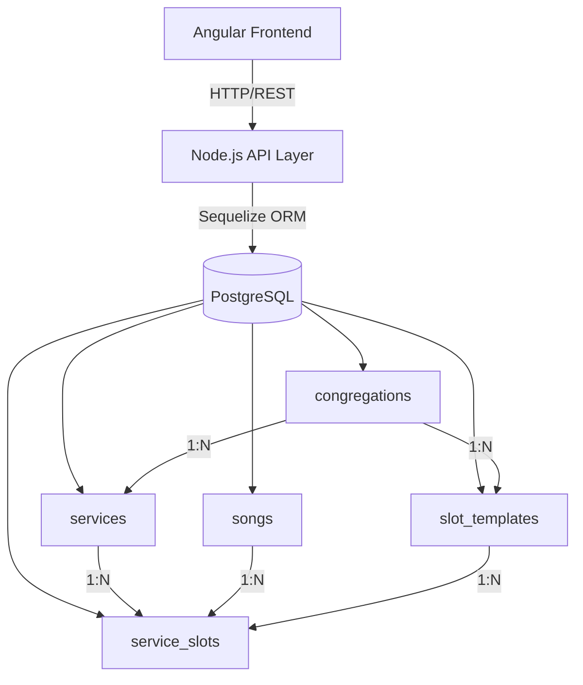
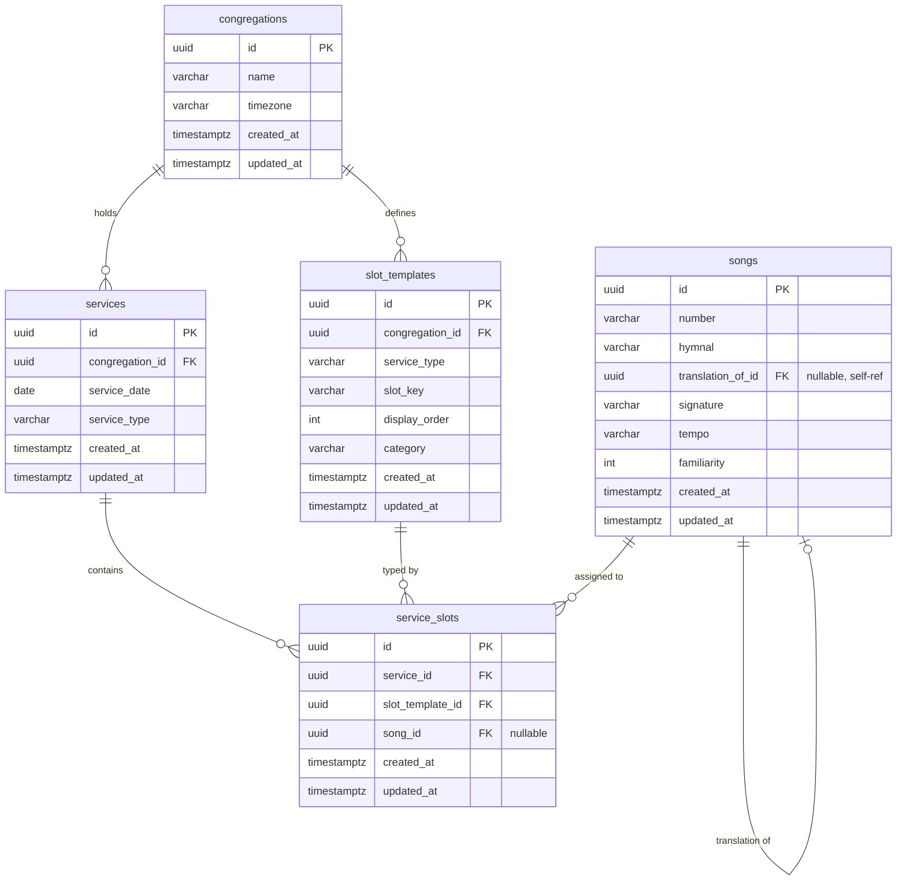

# Design Document: PostgreSQL Database Schema (Sequelize ORM)

## Overview

This document defines the relational PostgreSQL schema for the Music Planner application, implemented via Sequelize ORM in Node.js. The schema replaces the current JSON-file-based data layer with a persistent, multi-tenant-ready relational database that supports variable song slot configurations per service, cross-series song translation, and computed conflict detection.

The design prioritises normalisation, multi-tenancy via a `congregations` table, and computed (not stored) conflict data — conflicts are derived at query time using date-range window queries rather than persisted, keeping the schema lean and always-consistent.

---

## Architecture



---

## Entity Relationship Diagram



---

## Components and Interfaces

### Table: `congregations`

The root multi-tenancy anchor. Every other entity belongs to a congregation.

| Column | Type | Notes |
|---|---|---|
| `id` | `UUID` PK | `DEFAULT gen_random_uuid()` |
| `name` | `VARCHAR(255)` | NOT NULL, UNIQUE |
| `timezone` | `VARCHAR(64)` | e.g. `'Europe/London'`, default `'UTC'` |
| `created_at` | `TIMESTAMPTZ` | Sequelize managed |
| `updated_at` | `TIMESTAMPTZ` | Sequelize managed |

---

### Table: `slot_templates`

Defines the configurable set of song slots for a given service type within a congregation. Replaces the hardcoded 14-slot list (`orchestra1–5`, `choir1–4`, `congregationBS/OH/RP/CM1/CM2`).

| Column | Type | Notes |
|---|---|---|
| `id` | `UUID` PK | |
| `congregation_id` | `UUID` FK → `congregations.id` | NOT NULL, CASCADE DELETE |
| `service_type` | `VARCHAR(100)` | e.g. `'Sunday Service'`, `'Wednesday Service'` |
| `slot_key` | `VARCHAR(100)` | e.g. `'orchestra1'`, `'congregationBS'` |
| `display_order` | `INTEGER` | Sort order within a service |
| `category` | `VARCHAR(50)` | e.g. `'orchestra'`, `'choir'`, `'congregation'` |
| `created_at` | `TIMESTAMPTZ` | |
| `updated_at` | `TIMESTAMPTZ` | |

**Unique constraint**: `(congregation_id, service_type, slot_key)`

---

### Table: `songs`

The shared repertoire — one song list for all congregations, since all are assumed to be the same denomination. Each row is one song number in one hymnal. The `translation_of_id` column is a self-referencing FK pointing to the song this one is a translation of (e.g. `A10` points to `E7`).

| Column | Type | Notes |
|---|---|---|
| `id` | `UUID` PK | |
| `number` | `VARCHAR(20)` | e.g. `'A10'`, `'E7'`, `'BB1'` — normalised to uppercase |
| `hymnal` | `VARCHAR(10)` | Extracted prefix: `'A'`, `'E'`, `'BB'`, etc. |
| `translation_of_id` | `UUID` FK → `songs.id` | NULLABLE — points to the song this is a translation of |
| `signature` | `VARCHAR(100)` | Currently unused, reserved |
| `tempo` | `VARCHAR(50)` | Currently unused, reserved |
| `familiarity` | `SMALLINT` | `0` = normal, `-1` = excluded/unfamiliar |
| `created_at` | `TIMESTAMPTZ` | |
| `updated_at` | `TIMESTAMPTZ` | |

**Unique constraint**: `number`

**Index**: `hymnal` — supports filtering by hymnal

---

### Table: `services`

One row per scheduled service event.

| Column | Type | Notes |
|---|---|---|
| `id` | `UUID` PK | |
| `congregation_id` | `UUID` FK → `congregations.id` | NOT NULL, CASCADE DELETE |
| `service_date` | `DATE` | NOT NULL |
| `service_type` | `VARCHAR(100)` | e.g. `'Sunday Service'` |
| `created_at` | `TIMESTAMPTZ` | |
| `updated_at` | `TIMESTAMPTZ` | |

**Unique constraint**: `(congregation_id, service_date, service_type)`

**Index**: `(congregation_id, service_date)` — primary query pattern for schedule views

---

### Table: `service_slots`

One row per song slot per service. The junction between a service, a slot template, and an assigned song.

| Column | Type | Notes |
|---|---|---|
| `id` | `UUID` PK | |
| `service_id` | `UUID` FK → `services.id` | NOT NULL, CASCADE DELETE |
| `slot_template_id` | `UUID` FK → `slot_templates.id` | NOT NULL |
| `song_id` | `UUID` FK → `songs.id` | NULLABLE — null when slot is empty or `'N/A'` |
| `created_at` | `TIMESTAMPTZ` | |
| `updated_at` | `TIMESTAMPTZ` | |

**Unique constraint**: `(service_id, slot_template_id)`

**Index**: `(song_id, service_id)` — supports conflict window queries

---

## Key Design Decisions

### 1. Conflicts are computed, not stored

The current JSON format stores `conflicts`, `quarterConflicts`, and `yearConflicts` arrays inline. In the relational model these are **derived at query time** via a date-range self-join on `service_slots`:

```sql
-- Find all uses of the same song within 56 days of a given service
SELECT ss.slot_template_id, sv.service_date, sv.service_type
FROM service_slots ss
JOIN services sv ON sv.id = ss.service_id
WHERE ss.song_id = :songId
  AND sv.congregation_id = :congregationId
  AND sv.service_date BETWEEN :targetDate - INTERVAL '56 days' AND :targetDate + INTERVAL '56 days'
  AND ss.service_id != :serviceId;
```

Thresholds: ≤56 days = conflict, 57–90 days = quarter conflict, 91–365 days = year conflict.

This avoids stale conflict data and removes the need for a separate conflict table.

### 2. `slot_key` stored on `service_slots` via `slot_template_id`

Rather than duplicating the slot key string on every `service_slot` row, the slot identity is resolved through the `slot_templates` FK. This keeps slot configuration centralised and allows renaming slots without touching historical data.

### 3. `song_id` is nullable for empty slots

Empty slots and placeholder slots (`'N/A'`) are represented by `song_id = NULL`. Since `raw_number` is no longer stored, the application layer is responsible for distinguishing between "slot not yet filled" and "slot intentionally left empty" — both map to `NULL` at the DB level.

### 4. `hymnal` column on `songs`

The hymnal prefix (`A`, `E`, `BB`, etc.) is extracted from `number` at insert time and stored as a separate column. This avoids repeated `LIKE 'A%'` pattern matching in queries and supports efficient filtering by hymnal.

### 5. `translation_of_id` is a self-referencing FK

Rather than storing a translated number string, `translation_of_id` points directly to the target song row. This means translations are resolved via a join rather than a string lookup, keeping the data consistent — if a song row is updated, all translations pointing to it remain valid. The FK is nullable (songs with no translation have `NULL`). No CASCADE DELETE is set — if the target song is deleted, `translation_of_id` should be set to NULL (SET NULL).

### 5. Multi-tenancy via `congregation_id` on `services` and `slot_templates`

Schedule data and slot configuration are scoped to a congregation. The `songs` table is shared across all congregations — since all are the same denomination, the repertoire is common. No row-level security is assumed at the DB layer in v1 — the application layer enforces tenant isolation by always including `congregation_id` in service/slot queries. This can be upgraded to PostgreSQL RLS in future.

---

## Sequelize Model Definitions (TypeScript)

### `Congregation`

```typescript
import { Model, DataTypes, Sequelize } from 'sequelize';

export class Congregation extends Model {
  declare id: string;
  declare name: string;
  declare timezone: string;
}

Congregation.init({
  id: { type: DataTypes.UUID, defaultValue: DataTypes.UUIDV4, primaryKey: true },
  name: { type: DataTypes.STRING(255), allowNull: false, unique: true },
  timezone: { type: DataTypes.STRING(64), allowNull: false, defaultValue: 'UTC' },
}, {
  sequelize,
  tableName: 'congregations',
  underscored: true,
});
```

### `SlotTemplate`

```typescript
export class SlotTemplate extends Model {
  declare id: string;
  declare congregationId: string;
  declare serviceType: string;
  declare slotKey: string;
  declare displayOrder: number;
  declare category: string;
}

SlotTemplate.init({
  id: { type: DataTypes.UUID, defaultValue: DataTypes.UUIDV4, primaryKey: true },
  congregationId: { type: DataTypes.UUID, allowNull: false },
  serviceType: { type: DataTypes.STRING(100), allowNull: false },
  slotKey: { type: DataTypes.STRING(100), allowNull: false },
  displayOrder: { type: DataTypes.INTEGER, allowNull: false, defaultValue: 0 },
  category: { type: DataTypes.STRING(50), allowNull: false },
}, {
  sequelize,
  tableName: 'slot_templates',
  underscored: true,
  indexes: [{ unique: true, fields: ['congregation_id', 'service_type', 'slot_key'] }],
});
```

### `Song`

```typescript
export class Song extends Model {
  declare id: string;
  declare number: string;
  declare hymnal: string;
  declare translationOfId: string | null;
  declare signature: string | null;
  declare tempo: string | null;
  declare familiarity: number;
}

Song.init({
  id: { type: DataTypes.UUID, defaultValue: DataTypes.UUIDV4, primaryKey: true },
  number: { type: DataTypes.STRING(20), allowNull: false, unique: true },
  hymnal: { type: DataTypes.STRING(10), allowNull: false },
  translationOfId: { type: DataTypes.UUID, allowNull: true },
  signature: { type: DataTypes.STRING(100), allowNull: true },
  tempo: { type: DataTypes.STRING(50), allowNull: true },
  familiarity: { type: DataTypes.SMALLINT, allowNull: false, defaultValue: 0 },
}, {
  sequelize,
  tableName: 'songs',
  underscored: true,
  indexes: [
    { fields: ['hymnal'] },
  ],
});
```

### `Service`

```typescript
export class Service extends Model {
  declare id: string;
  declare congregationId: string;
  declare serviceDate: string;   // DATE — stored as 'YYYY-MM-DD'
  declare serviceType: string;
}

Service.init({
  id: { type: DataTypes.UUID, defaultValue: DataTypes.UUIDV4, primaryKey: true },
  congregationId: { type: DataTypes.UUID, allowNull: false },
  serviceDate: { type: DataTypes.DATEONLY, allowNull: false },
  serviceType: { type: DataTypes.STRING(100), allowNull: false },
}, {
  sequelize,
  tableName: 'services',
  underscored: true,
  indexes: [
    { unique: true, fields: ['congregation_id', 'service_date', 'service_type'] },
    { fields: ['congregation_id', 'service_date'] },
  ],
});
```

### `ServiceSlot`

```typescript
export class ServiceSlot extends Model {
  declare id: string;
  declare serviceId: string;
  declare slotTemplateId: string;
  declare songId: string | null;
}

ServiceSlot.init({
  id: { type: DataTypes.UUID, defaultValue: DataTypes.UUIDV4, primaryKey: true },
  serviceId: { type: DataTypes.UUID, allowNull: false },
  slotTemplateId: { type: DataTypes.UUID, allowNull: false },
  songId: { type: DataTypes.UUID, allowNull: true },
}, {
  sequelize,
  tableName: 'service_slots',
  underscored: true,
  indexes: [
    { unique: true, fields: ['service_id', 'slot_template_id'] },
    { fields: ['song_id', 'service_id'] },
  ],
});
```

### Associations

```typescript
// In a central associations.ts file
Congregation.hasMany(SlotTemplate, { foreignKey: 'congregationId', onDelete: 'CASCADE' });
Congregation.hasMany(Service, { foreignKey: 'congregationId', onDelete: 'CASCADE' });

Service.belongsTo(Congregation, { foreignKey: 'congregationId' });
Service.hasMany(ServiceSlot, { foreignKey: 'serviceId', onDelete: 'CASCADE' });

ServiceSlot.belongsTo(Service, { foreignKey: 'serviceId' });
ServiceSlot.belongsTo(SlotTemplate, { foreignKey: 'slotTemplateId' });
ServiceSlot.belongsTo(Song, { foreignKey: 'songId' });

SlotTemplate.belongsTo(Congregation, { foreignKey: 'congregationId' });
SlotTemplate.hasMany(ServiceSlot, { foreignKey: 'slotTemplateId' });

Song.hasMany(ServiceSlot, { foreignKey: 'songId' });

// Self-referencing translation relationship
Song.belongsTo(Song, { foreignKey: 'translationOfId', as: 'translationOf', onDelete: 'SET NULL' });
Song.hasMany(Song, { foreignKey: 'translationOfId', as: 'translations' });
```

---

## Key Query Patterns

### Load a full schedule for a congregation (with slot metadata)

```typescript
const services = await Service.findAll({
  where: { congregationId },
  order: [['serviceDate', 'ASC']],
  include: [{
    model: ServiceSlot,
    include: [
      { model: SlotTemplate, attributes: ['slotKey', 'displayOrder', 'category'] },
      { model: Song, attributes: ['number', 'hymnal', 'familiarity'], include: [
        { model: Song, as: 'translationOf', attributes: ['number', 'hymnal'] },
      ]},
    ],
  }],
});
```

### Compute conflicts for a song on a given service date

```typescript
// Returns all service_slots where the same song appears within the window
const conflicts = await ServiceSlot.findAll({
  where: { songId },
  include: [{
    model: Service,
    where: {
      congregationId,
      serviceDate: {
        [Op.between]: [
          moment(targetDate).subtract(windowDays, 'days').toDate(),
          moment(targetDate).add(windowDays, 'days').toDate(),
        ],
      },
      id: { [Op.ne]: serviceId },
    },
    attributes: ['serviceDate', 'serviceType'],
  }],
  include: [{ model: SlotTemplate, attributes: ['slotKey'] }],
});
```

### Seed slot templates from current hardcoded list

```typescript
const defaultSlots = [
  { serviceType: 'Sunday Service',    slotKey: 'orchestra1',      displayOrder: 1,  category: 'orchestra' },
  { serviceType: 'Sunday Service',    slotKey: 'orchestra2',      displayOrder: 2,  category: 'orchestra' },
  { serviceType: 'Sunday Service',    slotKey: 'orchestra3',      displayOrder: 3,  category: 'orchestra' },
  { serviceType: 'Sunday Service',    slotKey: 'orchestra4',      displayOrder: 4,  category: 'orchestra' },
  { serviceType: 'Sunday Service',    slotKey: 'orchestra5',      displayOrder: 5,  category: 'orchestra' },
  { serviceType: 'Sunday Service',    slotKey: 'choir1',          displayOrder: 6,  category: 'choir' },
  { serviceType: 'Sunday Service',    slotKey: 'choir2',          displayOrder: 7,  category: 'choir' },
  { serviceType: 'Sunday Service',    slotKey: 'choir3',          displayOrder: 8,  category: 'choir' },
  { serviceType: 'Sunday Service',    slotKey: 'choir4',          displayOrder: 9,  category: 'choir' },
  { serviceType: 'Sunday Service',    slotKey: 'congregationBS',  displayOrder: 10, category: 'congregation' },
  { serviceType: 'Sunday Service',    slotKey: 'congregationOH',  displayOrder: 11, category: 'congregation' },
  { serviceType: 'Sunday Service',    slotKey: 'congregationRP',  displayOrder: 12, category: 'congregation' },
  { serviceType: 'Sunday Service',    slotKey: 'congregationCM1', displayOrder: 13, category: 'congregation' },
  { serviceType: 'Sunday Service',    slotKey: 'congregationCM2', displayOrder: 14, category: 'congregation' },
  // Wednesday / Midweek use the same slot keys but fewer orchestra slots are typically filled
  // — same template rows apply; empty slots are represented by song_id = NULL
];
```

---

## Data Migration Strategy

When importing existing JSON schedule data:

1. Upsert the congregation row
2. Bulk-insert `songs` from `repertoire.json` — extract `series` from the `number` prefix
3. Seed `slot_templates` for each known `serviceType` × `slotKey` combination
4. For each service in `scheduleExample.json`:
   - Insert a `services` row
   - For each song slot: look up `song_id` by `(congregationId, UPPER(number))`, insert `service_slots`
   - `song_id = NULL` when `number` is `''` or `'N/A'`

---

## Error Handling

| Scenario | Handling |
|---|---|
| Duplicate service (same date + type) | Sequelize `upsert` or catch `UniqueConstraintError` |
| Unknown song number on slot insert | `song_id = NULL`, `raw_number` preserved |
| Missing slot template for a slot key | Create template on-the-fly or reject with 400 |
| Congregation not found | 404 from API layer before any DB write |

---

## Testing Strategy

### Unit tests (Sequelize model layer)
- Validate model field constraints (allowNull, unique) using an in-memory SQLite instance or a test PostgreSQL schema
- Test association eager-loading returns expected shape

### Integration tests (query patterns)
- Seed a congregation with known services and songs
- Assert conflict window queries return correct results for boundary dates (exactly 56, 57, 90, 91, 365 days)
- Assert `song_id = NULL` for `'N/A'` slots

### Property-based tests
- For any set of service dates and song assignments, conflict counts must be symmetric: if service A conflicts with service B, B must conflict with A
- Conflict threshold boundaries: a song used exactly 56 days apart must appear in `conflicts`; exactly 57 days apart must not

---

## Correctness Properties

*A property is a characteristic or behavior that should hold true across all valid executions of a system — essentially, a formal statement about what the system should do. Properties serve as the bridge between human-readable specifications and machine-verifiable correctness guarantees.*

### Property 1: Timezone default

*For any* congregation inserted without an explicit timezone value, the stored timezone SHALL equal `'UTC'`.

**Validates: Requirement 1.2**

---

### Property 2: Congregation name uniqueness

*For any* two congregation insert operations sharing the same name, the second operation SHALL raise a unique constraint error and leave the database state unchanged.

**Validates: Requirement 1.3**

---

### Property 3: Cascade delete removes all child rows

*For any* congregation with associated slot templates, services, and service slots, deleting the congregation SHALL result in zero remaining rows in `slot_templates`, `services`, and `service_slots` that reference that congregation.

**Validates: Requirements 2.2, 4.2, 5.2**

---

### Property 4: Slot template uniqueness per congregation

*For any* two slot template insert operations sharing the same `(congregation_id, service_type, slot_key)` triple, the second operation SHALL raise a unique constraint error.

**Validates: Requirement 2.3**

---

### Property 5: Song number uppercase normalisation

*For any* song number string (regardless of case), after insertion the stored `number` value SHALL be the uppercase equivalent of the input.

**Validates: Requirements 3.2, 11.3**

---

### Property 6: Hymnal prefix extraction

*For any* song number with a known alphabetic prefix (e.g. `A`, `E`, `BB`), after insertion the stored `hymnal` value SHALL equal the extracted prefix from the `number` column.

**Validates: Requirement 3.3**

---

### Property 7: Song number uniqueness

*For any* two song insert operations sharing the same normalised number, the second operation SHALL raise a unique constraint error.

**Validates: Requirement 3.4**

---

### Property 8: Translation SET NULL on song delete

*For any* song `S` that has `translation_of_id` pointing to song `T`, after deleting `T` the `translation_of_id` on `S` SHALL be NULL.

**Validates: Requirement 3.6**

---

### Property 9: Service uniqueness per congregation

*For any* two service insert operations sharing the same `(congregation_id, service_date, service_type)` triple, the second operation SHALL raise a unique constraint error.

**Validates: Requirement 4.3**

---

### Property 10: Service slot uniqueness per service

*For any* two service slot insert operations sharing the same `(service_id, slot_template_id)` pair, the second operation SHALL raise a unique constraint error.

**Validates: Requirement 5.3**

---

### Property 11: Conflict window symmetry

*For any* two services A and B belonging to the same congregation, if song X appears in service A and the conflict query for service B with song X returns service A, then the conflict query for service A with song X SHALL also return service B.

**Validates: Requirements 7.1, 7.5**

---

### Property 12: Conflict query excludes target service

*For any* conflict query for a given service and song, the target service itself SHALL NOT appear in the returned results.

**Validates: Requirement 7.5**

---

### Property 13: Conflict query tenant isolation

*For any* two congregations C1 and C2 that both schedule the same song on the same date, a conflict query scoped to C1 SHALL NOT return any service slots belonging to C2.

**Validates: Requirements 7.6, 10.1, 10.2, 10.3**

---

### Property 14: Tenant isolation on service queries

*For any* repository query for services filtered by `congregation_id`, all returned service rows SHALL have a `congregation_id` equal to the requested value — no rows from other congregations SHALL appear.

**Validates: Requirements 10.1, 10.2**

---

## Performance Considerations

- The `(congregation_id, service_date)` index on `services` makes date-range schedule loads O(log n)
- The `(song_id, service_id)` index on `service_slots` makes conflict window queries efficient even with large schedules
- For a typical congregation (≤500 services/year, ≤14 slots each = ≤7000 rows/year), no partitioning is needed
- If multi-congregation scale grows, consider PostgreSQL row-level security + connection pooling via `pg-pool`

---

## Security Considerations

- All queries must include `congregation_id` in the `WHERE` clause — enforced at the service/repository layer, not DB-level in v1
- UUIDs as PKs prevent enumeration attacks
- Song numbers are normalised to uppercase on write to prevent duplicate entries via case variation
- No raw SQL — all queries go through Sequelize to prevent injection

---

## Dependencies

| Package | Purpose |
|---|---|
| `sequelize` | ORM |
| `sequelize-typescript` | Optional TypeScript decorators (alternative to `Model.init`) |
| `pg` | PostgreSQL driver |
| `pg-hstore` | Serialise/deserialise hstore data |
| `umzug` | Migration runner (recommended over `sequelize-cli` for programmatic use) |
