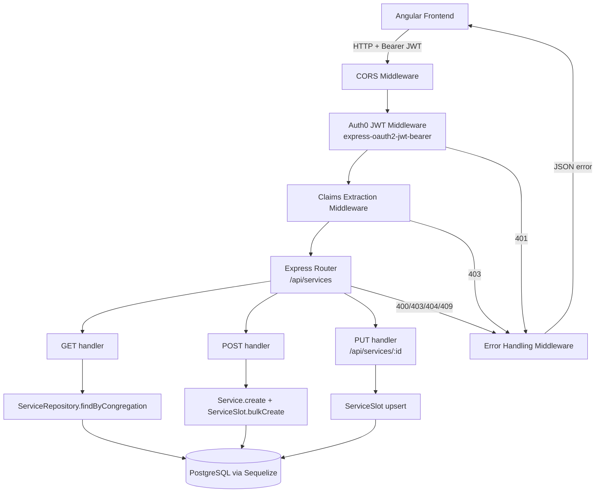

# Design Document: Service API

## Overview

This document describes the design for the Music Planner Service API — an Express.js REST server written in TypeScript that exposes `GET /api/services`, `POST /api/services`, and `PUT /api/services/:id` endpoints. The API sits between the Angular 17 frontend and the existing Sequelize data layer, enforcing Auth0 JWT authentication and claims-based multi-tenant scoping so that every request is automatically restricted to the caller's congregation.

Auth0 JWT validation is handled by `express-oauth2-jwt-bearer`, which fetches the JWKS from the Auth0 tenant, verifies the token signature, and validates `aud` and `iss` claims automatically. A thin claims-extraction middleware then reads the `congregation_id` custom claim from the validated token and attaches it to the Express `Request` object for use by route handlers.

---

## Architecture



### File Structure

```
src/server/api/
  app.ts              # Express app factory (no listen call — testable)
  server.ts           # Entry point: validates env, calls app.listen
  middleware/
    auth.ts           # express-oauth2-jwt-bearer setup
    claims.ts         # congregation_id extraction + req augmentation
    errorHandler.ts   # maps known errors → HTTP status codes
  routes/
    services.ts       # GET and POST /api/services handlers
  types/
    express.d.ts      # Augments Express Request with auth claims
```

---

## Components and Interfaces

### Environment Validation (`server.ts`)

Reads and validates required environment variables at startup. Exits with a non-zero code if any required variable is missing.

```typescript
const required = ['AUTH0_DOMAIN', 'AUTH0_AUDIENCE'];
for (const key of required) {
  if (!process.env[key]) {
    console.error(`Missing required environment variable: ${key}`);
    process.exit(1);
  }
}
```

Required variables:

| Variable | Purpose | Default |
|---|---|---|
| `AUTH0_DOMAIN` | Auth0 tenant domain (e.g. `dev-xxx.us.auth0.com`) | — (required) |
| `AUTH0_AUDIENCE` | Auth0 API identifier | — (required) |
| `PORT` | HTTP listen port | `3000` |
| `ALLOWED_ORIGINS` | Comma-separated CORS origins | — |

---

### Auth Middleware (`middleware/auth.ts`)

Uses `express-oauth2-jwt-bearer` to validate the JWT. The library handles JWKS fetching, caching, signature verification, and `aud`/`iss` validation automatically.

```typescript
import { auth } from 'express-oauth2-jwt-bearer';

export const jwtCheck = auth({
  audience: process.env['AUTH0_AUDIENCE'],
  issuerBaseURL: `https://${process.env['AUTH0_DOMAIN']}`,
  tokenSigningAlg: 'RS256',
});
```

On failure the library calls `next(err)` with an `UnauthorizedError`, which the error handler maps to `401`.

---

### Claims Extraction Middleware (`middleware/claims.ts`)

Runs after `jwtCheck`. Reads the `congregation_id` custom claim (namespaced as `https://music-planner.app/congregation_id`) from the validated token payload and attaches it to `req.auth.congregationId`.

```typescript
const CONGREGATION_CLAIM = 'https://music-planner.app/congregation_id';

export function extractClaims(req: Request, res: Response, next: NextFunction): void {
  const congregationId = req.auth?.payload[CONGREGATION_CLAIM] as string | undefined;
  if (!congregationId) {
    res.status(403).json({ error: 'Missing congregation_id claim in token' });
    return;
  }
  req.congregationId = congregationId;
  next();
}
```

---

### Express Request Type Augmentation (`types/express.d.ts`)

Extends the Express `Request` interface so `req.congregationId` is typed throughout the codebase.

```typescript
declare namespace Express {
  interface Request {
    congregationId: string;
  }
}
```

---

### Services Router (`routes/services.ts`)

Mounts at `/api/services`. Both handlers rely on `req.congregationId` set by the claims middleware — they never read `congregation_id` from query params or request body.

#### GET /api/services

1. Optionally parses `from` and `to` query params; validates both are present together and match `YYYY-MM-DD`.
2. Calls `ServiceRepository.findByCongregation(req.congregationId, dateRange?)`.
3. Returns `200` with the JSON array.

#### POST /api/services

1. Validates `serviceDate` (required, `YYYY-MM-DD`) and `serviceType` (required, non-empty string) from the request body.
2. Calls `Service.create({ congregationId: req.congregationId, serviceDate, serviceType })`.
3. If the body includes a `slots` array, looks up each `SlotTemplate` by `(congregationId, serviceType, slotKey)` and bulk-creates `ServiceSlot` rows for matched templates; unrecognised `slotKey` values are silently skipped.
4. Returns `201` with the created service object including its slots (eager-loaded).
5. On `UniqueConstraintError` returns `409`.

#### PUT /api/services/:id

1. Looks up the service by `id`. Returns `404` if not found.
2. Compares `service.congregationId` with `req.congregationId`. Returns `403` if they differ.
3. For each entry in the `slots` array, looks up the `SlotTemplate` by `(congregationId, serviceType, slotKey)`; silently skips unrecognised keys.
4. For each matched template, upserts the `ServiceSlot` on `(serviceId, slotTemplateId)` — updating `songId` if the row exists, inserting otherwise.
5. Returns `200` with the updated service including all its current slots (eager-loaded).

---

### Error Handling Middleware (`middleware/errorHandler.ts`)

Centralised error handler registered last in the Express pipeline.

| Error type | HTTP status | Response body |
|---|---|---|
| `UnauthorizedError` (from `express-oauth2-jwt-bearer`) | 401 | `{ "error": "Unauthorized" }` |
| `UniqueConstraintError` (Sequelize) | 409 | `{ "error": "Service already exists" }` |
| Any other error | 500 | `{ "error": "Internal server error" }` |

Stack traces and database error details are never forwarded to the client.

---

### CORS Middleware (`app.ts`)

Uses the `cors` npm package. Allowed origins are read from `ALLOWED_ORIGINS` (comma-separated). In development, `http://localhost:4200` is always included.

```typescript
const allowedOrigins = (process.env['ALLOWED_ORIGINS'] ?? '')
  .split(',')
  .map(o => o.trim())
  .filter(Boolean);

app.use(cors({
  origin: allowedOrigins,
  allowedHeaders: ['Authorization', 'Content-Type', 'Accept'],
  optionsSuccessStatus: 204,
}));
```

---

## Data Models

### Request / Response shapes

#### GET /api/services

Query params (all optional, but `from` and `to` must appear together):

```
GET /api/services?from=2025-01-01&to=2025-03-31
Authorization: Bearer <jwt>
```

Response `200`:

```json
[
  {
    "id": "uuid",
    "congregationId": "uuid",
    "serviceDate": "2025-01-05",
    "serviceType": "Sunday Service",
    "serviceSlots": [ ... ]
  }
]
```

#### POST /api/services

```json
// Request body (slots is optional)
{
  "serviceDate": "2025-04-06",
  "serviceType": "Sunday Service",
  "slots": [
    { "slotKey": "orchestra1", "songId": "uuid-of-song" },
    { "slotKey": "choir1", "songId": null },
    { "slotKey": "unknownKey" }
  ]
}

// Response 201 — includes created slots (unknownKey entry was ignored)
{
  "id": "uuid",
  "congregationId": "uuid",
  "serviceDate": "2025-04-06",
  "serviceType": "Sunday Service",
  "serviceSlots": [
    { "id": "uuid", "slotTemplateId": "uuid", "songId": "uuid-of-song", "slotTemplate": { "slotKey": "orchestra1", ... } },
    { "id": "uuid", "slotTemplateId": "uuid", "songId": null,           "slotTemplate": { "slotKey": "choir1", ... } }
  ]
}
```

#### PUT /api/services/:id

```json
// Request body
{
  "slots": [
    { "slotKey": "orchestra1", "songId": "new-song-uuid" },
    { "slotKey": "choir2" }
  ]
}

// Response 200 — full service with all current slots after upsert
{
  "id": "uuid",
  "congregationId": "uuid",
  "serviceDate": "2025-04-06",
  "serviceType": "Sunday Service",
  "serviceSlots": [ ... ]
}
```

#### Slot entry shape (used in both POST and PUT)

```typescript
interface SlotInput {
  slotKey: string;       // must match a SlotTemplate.slotKey for this congregation + serviceType
  songId?: string | null; // UUID of the song to assign, or null/omitted for an empty slot
}
```

#### Error body (all error responses)

```json
{ "error": "<human-readable message>" }
```

### Date validation regex

`YYYY-MM-DD` format is validated with: `/^\d{4}-\d{2}-\d{2}$/`

### Congregation ID claim namespace

The custom Auth0 claim key is `https://music-planner.app/congregation_id`. This namespace is required by Auth0 for custom claims to avoid collisions with OIDC standard claims.

---


## Correctness Properties

*A property is a characteristic or behavior that should hold true across all valid executions of a system — essentially, a formal statement about what the system should do. Properties serve as the bridge between human-readable specifications and machine-verifiable correctness guarantees.*

### Property 1: Invalid tokens are rejected with 401

*For any* HTTP request carrying a token that fails JWT validation — whether due to a malformed token string, an expired token, a signature from the wrong key, a mismatched `aud` claim, or a mismatched `iss` claim — the API SHALL respond with `401 Unauthorized` and a JSON body containing an `error` field.

**Validates: Requirements 1.2, 1.4, 1.5, 1.6**

---

### Property 2: congregation_id claim is extracted and attached

*For any* valid JWT whose payload contains the `https://music-planner.app/congregation_id` claim, the claims extraction middleware SHALL attach that exact claim value to `req.congregationId` — the value on the request object SHALL equal the value in the token payload.

**Validates: Requirements 2.1**

---

### Property 3: Congregation scoping invariant

*For any* authenticated request to either `GET /api/services` or `POST /api/services`, the `congregation_id` value used to scope the database operation SHALL equal the value from the token claims, regardless of any `congregation_id` value present in the query parameters or request body.

**Validates: Requirements 2.3, 2.4, 3.2, 4.2, 4.8**

---

### Property 4: GET returns repository results as 200 JSON array

*For any* congregation and any array of services returned by `ServiceRepository.findByCongregation`, the `GET /api/services` handler SHALL respond with status `200` and a JSON body that is an array containing exactly those service objects.

**Validates: Requirements 3.5**

---

### Property 5: Date range is forwarded to the repository unchanged

*For any* pair of valid `YYYY-MM-DD` date strings `from` and `to` supplied as query parameters, the `GET /api/services` handler SHALL pass a `DateRange` object with those exact `from` and `to` values to `ServiceRepository.findByCongregation`.

**Validates: Requirements 3.3**

---

### Property 6: Invalid date strings produce 400

*For any* string that does not match the pattern `YYYY-MM-DD`, supplying it as `from`, `to` (on GET), or `serviceDate` (on POST) SHALL cause the handler to respond with `400 Bad Request` and a JSON body containing an `error` field.

**Validates: Requirements 3.6, 4.6**

---

### Property 7: Successful POST returns 201 with the created service

*For any* valid `serviceDate` and `serviceType` in the request body, the `POST /api/services` handler SHALL respond with status `201 Created` and a JSON body representing the newly created service, where the `congregationId` field equals the value from the token claims.

**Validates: Requirements 4.2, 4.3**

---

### Property 8: Missing required POST fields produce 400

*For any* POST request body that omits `serviceDate`, omits `serviceType`, or supplies either as an empty/whitespace-only string, the handler SHALL respond with `400 Bad Request` and a JSON body containing an `error` field.

**Validates: Requirements 4.4, 4.5**

---

### Property 9: All error responses carry an `error` string field

*For any* request that results in an error response (status 400, 401, 403, 409, or 500), the response body SHALL be valid JSON containing at minimum an `error` field whose value is a non-empty string.

**Validates: Requirements 5.1, 5.2**

---

### Property 10: Error responses do not leak internal details

*For any* error response, the serialised response body SHALL NOT contain a stack trace string, a Sequelize error class name, or raw database error message text.

**Validates: Requirements 5.4**

---

### Property 11: Unhandled errors produce 500

*For any* unexpected error thrown inside a route handler (i.e. not a `UniqueConstraintError` or a validation error), the error handling middleware SHALL respond with status `500` and a JSON body containing an `error` field.

**Validates: Requirements 5.1**

---

### Property 12: POST with slots creates ServiceSlot rows scoped to congregation's SlotTemplates

*For any* POST request body that includes a `slots` array (with a mix of valid and unknown `slotKey` values), after a successful `201` response the created service SHALL contain `ServiceSlot` rows only for entries whose `slotKey` matched a `SlotTemplate` belonging to the caller's congregation and `serviceType` — entries with unrecognised `slotKey` values SHALL produce no `ServiceSlot` row and SHALL NOT cause an error.

**Validates: Requirements 4.9, 4.10**

---

### Property 13: PUT with unknown service id returns 404

*For any* UUID that does not correspond to an existing service row, a `PUT /api/services/:id` request SHALL respond with `404 Not Found` and a JSON body containing an `error` field.

**Validates: Requirements 8.2**

---

### Property 14: PUT with service belonging to a different congregation returns 403

*For any* service that exists but whose `congregationId` differs from the `congregation_id` in the caller's token, a `PUT /api/services/:id` request SHALL respond with `403 Forbidden` and a JSON body containing an `error` field.

**Validates: Requirements 8.3**

---

### Property 15: PUT slots array upserts ServiceSlot rows correctly

*For any* existing service and any `slots` array supplied to `PUT /api/services/:id`, after a successful `200` response: every slot entry whose `slotKey` matched a `SlotTemplate` SHALL be reflected in the service's `serviceSlots` with the correct `songId`; slots that already existed SHALL have their `songId` updated; slots that did not exist SHALL have been created; and the response body SHALL be the full updated service object including all current slots.

**Validates: Requirements 8.4, 8.5, 8.6**

---

## Error Handling

| Scenario | Middleware / Handler | HTTP Status | Response body |
|---|---|---|---|
| Missing `Authorization` header | `express-oauth2-jwt-bearer` | 401 | `{ "error": "Unauthorized" }` |
| Malformed / expired / wrong-key JWT | `express-oauth2-jwt-bearer` | 401 | `{ "error": "Unauthorized" }` |
| Wrong `aud` or `iss` | `express-oauth2-jwt-bearer` | 401 | `{ "error": "Unauthorized" }` |
| Missing `congregation_id` claim | `extractClaims` | 403 | `{ "error": "Missing congregation_id claim in token" }` |
| Invalid date format in query/body | Route handler | 400 | `{ "error": "<field> must be in YYYY-MM-DD format" }` |
| Partial date range (only `from` or `to`) | Route handler | 400 | `{ "error": "Both from and to are required" }` |
| Missing `serviceDate` or `serviceType` | Route handler | 400 | `{ "error": "<field> is required" }` |
| Duplicate `(congregation_id, serviceDate, serviceType)` | Error handler | 409 | `{ "error": "Service already exists" }` |
| Service `:id` not found (PUT) | Route handler | 404 | `{ "error": "Service not found" }` |
| Service `:id` belongs to different congregation (PUT) | Route handler | 403 | `{ "error": "Forbidden" }` |
| Any other unhandled error | Error handler | 500 | `{ "error": "Internal server error" }` |

The error handler inspects the error type:

```typescript
import { errors } from 'jose'; // re-exported by express-oauth2-jwt-bearer
import { UniqueConstraintError } from 'sequelize';

export function errorHandler(err, req, res, next) {
  if (err instanceof UnauthorizedError) {
    return res.status(401).json({ error: 'Unauthorized' });
  }
  if (err instanceof UniqueConstraintError) {
    return res.status(409).json({ error: 'Service already exists' });
  }
  console.error(err); // log internally, never forward
  res.status(500).json({ error: 'Internal server error' });
}
```

---

## Testing Strategy

### Dual Testing Approach

Both unit/integration tests and property-based tests are required. They are complementary:

- **Unit / integration tests** cover specific examples, edge cases, and integration with the Express pipeline (using `supertest`).
- **Property-based tests** verify universal invariants across randomly generated inputs (using `fast-check`).

### Unit / Integration Tests (Jest + supertest)

The Express app is exported from `app.ts` without calling `listen`, making it directly testable with `supertest`. Auth0 JWT validation is mocked using `jest.mock` or by injecting a test middleware that bypasses `express-oauth2-jwt-bearer` and sets `req.auth` directly.

Key example tests:

- `GET /api/services` with no `Authorization` header → 401
- `GET /api/services` with a valid token but no `congregation_id` claim → 403
- `GET /api/services` with `from` but no `to` → 400
- `POST /api/services` with missing `serviceDate` → 400
- `POST /api/services` with missing `serviceType` → 400
- `POST /api/services` that triggers `UniqueConstraintError` → 409
- `OPTIONS /api/services` preflight → 204 with CORS headers
- Startup validation exits with non-zero code when `AUTH0_DOMAIN` is absent

### Property-Based Tests (fast-check)

Library: `fast-check` (TypeScript-native, no additional setup beyond `npm install fast-check`).

Each property test runs a minimum of **100 iterations**.

Each test is tagged with a comment in the format:
`// Feature: service-api, Property <N>: <property_text>`

| Property | Generator | Assertion |
|---|---|---|
| P1: Invalid tokens → 401 | `fc.string()` filtered to non-JWT strings | status === 401, body has `error` field |
| P2: congregation_id extraction | `fc.uuid()` as claim value | `req.congregationId === claimValue` |
| P3: Congregation scoping | `fc.uuid()` for token claim + `fc.uuid()` for body/query override | DB called with token's UUID, not override |
| P4: GET returns repo results | `fc.array(serviceArbitrary)` | response body deep-equals repo return value |
| P5: Date range forwarded | `fc.tuple(dateArbitrary, dateArbitrary)` | repo called with exact `{ from, to }` |
| P6: Invalid dates → 400 | `fc.string()` filtered to non-YYYY-MM-DD | status === 400, body has `error` field |
| P7: POST 201 with correct congregationId | `fc.tuple(dateArbitrary, fc.string())` | status === 201, `body.congregationId === tokenClaim` |
| P8: Missing POST fields → 400 | `fc.record` with missing/empty fields | status === 400, body has `error` field |
| P9: All errors have `error` field | Trigger each error path | `typeof body.error === 'string' && body.error.length > 0` |
| P10: No stack traces in errors | Throw arbitrary errors in handler | body string does not contain `'Error:'` or `'at '` stack frames |
| P11: Unhandled errors → 500 | `fc.anything()` thrown as error | status === 500, body has `error` field |
| P12: POST slots creates only matched ServiceSlots | `fc.array` of slot inputs mixing valid/unknown slotKeys | response slots contain only entries with known slotKeys; unknown keys produce no slot row |
| P13: PUT unknown id → 404 | `fc.uuid()` not in DB | status === 404, body has `error` field |
| P14: PUT wrong congregation → 403 | service owned by congregation B, token for congregation A | status === 403, body has `error` field |
| P15: PUT slots upserts correctly | existing service + `fc.array` of slot inputs | response status === 200; each matched slot has correct `songId`; pre-existing slots updated; new slots created |

### Property Test Configuration

```typescript
import fc from 'fast-check';

// Minimum iterations
fc.assert(fc.property(...), { numRuns: 100 });

// Date arbitrary (valid YYYY-MM-DD)
const dateArbitrary = fc.date({ min: new Date('2020-01-01'), max: new Date('2030-12-31') })
  .map(d => d.toISOString().slice(0, 10));

// Invalid date arbitrary
const invalidDateArbitrary = fc.string().filter(s => !/^\d{4}-\d{2}-\d{2}$/.test(s));
```
